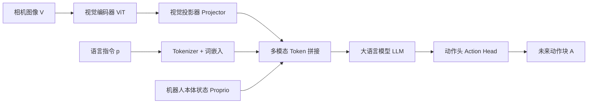

# QVLA 论文、VLA 网络与开源代码精读

> 对应论文：[QVLA: Not All Channels Are Equal in Vision-Language-Action Model's Quantization](https://arxiv.org/abs/2602.03782)
> 官方仓库：[AutoLab-SAI-SJTU/QVLA](https://github.com/AutoLab-SAI-SJTU/QVLA)
> 本文核对的仓库提交：`26cc4821a3be4c003d09d3c7997b38db2a347982`

这份文档的目标不是只教你运行命令，而是让你能回答四个问题：

1. VLA 怎样把图像和语言变成机器人动作？
2. INT4 为什么会破坏策略，为什么不同通道受影响不同？
3. QVLA 论文到底提出了什么，实验结果说明了什么？
4. 官方仓库实际实现了哪一部分，尚缺哪一部分？

---

## 1. 先建立完整心智模型

VLA 是 **Vision-Language-Action**，即视觉-语言-动作模型。它可以抽象为：

\[
\pi_\theta(A_t\mid V_t,p)
\]

- `V_t`：时刻 `t` 的视觉观察，例如第三人称相机和腕部相机图像。
- `p`：语言指令，例如“把黑碗放到左边盘子里”。
- `A_t`：模型预测的动作，或未来一小段动作序列。
- `pi_theta`：参数为 `theta` 的机器人策略。策略就是“看到什么、听到什么之后如何行动”的函数。

QVLA 并不重新训练一个 VLA。它在已有 VLA 上做 **PTQ（Post-Training Quantization，训练后量化）**：不再大规模训练模型，而是用少量校准数据判断哪些权重通道敏感，再分配不同位宽。



论文将模型概括为四部分：视觉编码器 `theta_vis`、投影器 `theta_proj`、LLM `theta_llm` 和动作解码器 `theta_act`。仓库主实验采用 OpenVLA-OFT；在 LIBERO 配置下，一次通常预测 `8 x 7` 个连续动作值。

---

## 2. 手撕 OpenVLA-OFT 的前向过程

下面先忽略工程细节，只看一个样本怎样流过网络。设批量大小 `B=1`。

### 2.1 图像变成视觉 token

ViT（Vision Transformer）先把图像切成固定大小的 patch。每个 patch 展平后线性映射成向量，再加入位置编码：

\[
X_{img}\in\mathbb{R}^{B\times N_{patch}\times D_{vision}}
\]

OpenVLA-OFT 可以融合 SigLIP 与 DINOv2 两套视觉特征，也可以同时处理主相机和腕部相机。直觉上：SigLIP 更强调图文语义对齐，DINOv2 擅长通用视觉结构；融合后既要“认得是什么”，也要“看清在哪里”。

### 2.2 Projector 对齐视觉维度和语言维度

视觉编码器输出维度通常不等于 LLM 隐藏维度。投影器是一个 MLP：

\[
X_{proj}=W_2\,\phi(W_1X_{img}+b_1)+b_2
\]

它不是把图像变成文字，而是把视觉向量变换到 LLM 能接收的向量空间。论文发现 projector 很敏感，因此发布代码默认不量化它。

### 2.3 语言变成文本 token

Tokenizer 把指令拆成离散 token id，词嵌入表再把 id 变为向量：

\[
X_{text}\in\mathbb{R}^{B\times N_{text}\times D_{llm}}
\]

LIBERO 推理中，仓库构造的提示词形式类似：

```text
In: What action should the robot take to <任务文本>?
Out:
```

### 2.4 拼接多模态 token

可把送入 LLM 的序列粗略理解为：

```text
[BOS] [视觉 token...] [本体状态 token] [语言 token...] [动作占位 token...]
```

`BOS` 是序列开始标记。`proprioception`（本体感知）是机器人对自身状态的测量；LIBERO 中是 8 维状态。动作占位 token 为动作头提供固定数量的隐藏状态。

### 2.5 Transformer 在 token 间交换信息

每层 Transformer 的核心包含自注意力和前馈网络：

\[
Q=XW_Q,\quad K=XW_K,\quad V=XW_V
\]

\[
\operatorname{Attention}(Q,K,V)
=\operatorname{softmax}(QK^T/\sqrt d)V
\]

注意力回答“当前 token 应该从其他 token 读取多少信息”。MLP/FFN 则对每个 token 做非线性特征变换。OpenVLA-OFT 对动作 token 采用特殊的双向可见性，使同一动作块内部能相互协调，而普通文本生成一般采用因果遮罩。

### 2.6 动作头输出连续动作块

L1 回归动作头抽取动作占位 token 的隐藏状态，经 MLP 输出：

\[
\hat A_t\in\mathbb{R}^{B\times 8\times 7}
\]

LIBERO 的 7 维动作通常表示：末端位移 3 维、旋转变化 3 维、夹爪 1 维。模型一次预测未来 8 步，这叫 **action chunking（动作分块）**。评测程序把动作放入队列，连续执行最多 8 步后再观察和推理，因此它不是每个环境步都重新调用模型。

OFT 还支持 diffusion action head。它从噪声动作开始，多次预测噪声并去噪得到动作；表达能力更强，但推理过程比一次 MLP 回归复杂。

### 2.7 一个最小化的 PyTorch 骨架

下面不是仓库原代码，而是帮助理解模块边界的“解剖图”：

```python
class TinyVLA(nn.Module):
    def __init__(self, vision, projector, llm, action_head):
        super().__init__()
        self.vision = vision
        self.projector = projector
        self.llm = llm
        self.action_head = action_head

    def forward(self, images, text_ids, proprio, action_placeholders):
        image_tokens = self.projector(self.vision(images))
        text_tokens = self.llm.get_input_embeddings()(text_ids)
        tokens = torch.cat(
            [image_tokens, encode_proprio(proprio), text_tokens,
             action_placeholders], dim=1
        )
        hidden = self.llm(inputs_embeds=tokens).last_hidden_state
        action_hidden = select_action_tokens(hidden)
        return self.action_head(action_hidden)  # [B, 8, 7]
```

真正代码多了 attention mask、token 位置、两幅图像、归一化、缓存、LoRA 和不同动作头，但主干逻辑就是这几步。

---

## 3. 量化基础：从浮点数到 INT4

### 3.1 权重、激活与位宽

- **权重（weight）**：训练学到的参数，例如 Linear 的矩阵 `W`。
- **激活（activation）**：输入经过层计算得到的中间值，例如 `XW`。
- **BF16**：16 位脑浮点格式，动态范围接近 FP32，常用作大模型基线。
- **INT4**：4 位整数。带符号时常用范围为 `[-8, 7]` 或对称范围 `[-7, 7]`。
- **W4A16**：权重 4 bit，激活 16 bit。
- **W4A4**：权重和激活都是 4 bit。

理论上，从 16 bit 权重降到 4 bit，纯权重存储可缩小到四分之一。但真实显存还包含 scale、元数据、未量化层、激活和运行时工作区，因此模型总显存不会严格缩小四倍。

### 3.2 对称量化

对一行权重 `w`，最简单的对称量化为：

\[
q_{max}=2^{b-1}-1,\qquad
s=\frac{\max |w|}{q_{max}}
\]

\[
q=\operatorname{clip}(\operatorname{round}(w/s),-q_{max},q_{max}),
\qquad \hat w=sq
\]

`s` 是 scale，`q` 才是整数，`hat w` 是反量化后的近似浮点权重。`w-hat w` 是量化误差。

```python
def fake_quant_row(w, bits):
    qmax = 2 ** (bits - 1) - 1
    scale = w.abs().max() / qmax
    q = (w / scale).round().clamp(-qmax, qmax)
    return q * scale
```

这叫 **fake quantization（假量化）**：计算了 INT4 舍入误差，但最后仍以浮点张量保存和执行。它能验证精度，不能证明 INT4 存储和内核加速。

### 3.3 对称与非对称量化

- 对称量化：零点固定为 0，实现简单，适合近似以 0 为中心的权重。
- 非对称量化：还引入 zero-point，能利用完整整数范围，适合明显偏斜的分布。

### 3.4 量化粒度

- per-tensor：整个张量共用一个 scale，便宜但容易被极端值拖累。
- per-channel：每个输出通道一个 scale，精度通常更高。
- per-group：每若干连续元素共享一个 scale，是大模型 INT4 内核常用折中。

对 `nn.Linear(in_features, out_features)`，权重形状为 `[out_features, in_features]`。QVLA 所说的一个 **channel** 是其中一行，也就是一个输出通道。对卷积则是一个输出卷积核。

### 3.5 PTQ、QAT、剪枝与混合精度

- PTQ：训练完成后量化，成本低；QVLA 属于这一类。
- QAT：量化感知训练，在训练中模拟量化误差，通常更稳但成本高。
- pruning（剪枝）：直接移除权重。QVLA 的 `0 bit` 表示把整个通道置零。
- mixed precision（混合精度）：不同层或通道使用不同位宽。

---

## 4. 为什么“不是所有通道都一样”

仅看权重误差 `||W-Q(W)||` 不够。某一行权重数值误差很大，可能对最终动作几乎没影响；另一行的误差虽小，却可能经过深层网络放大，让夹爪提前闭合或末端位置偏离。

对第 `l` 层第 `c` 个通道，论文定义在位宽 `b` 下的动作敏感度。单步直观定义是：

\[
s_{l,c}^{(b)}=
\mathbb E_x\left[\|\widetilde A_{l,c}^{(b)}(x)-A^*(x)\|_2^2\right]
\]

- `A*`：全精度模型动作。
- `A~`：只扰动该通道后的动作。
- 敏感度越大，说明这个通道越不能随便降位。

论文还强调轨迹上的累积效应：机器人某一步轻微偏差会改变下一步看到的图像，误差可能沿闭环交互放大。累计形式是：

\[
S_{l,c}^{(b)}=
\mathbb E\sum_t
\|\widetilde A_{l,c}^{(b)}(V_t,p)-A^*(V_t,p)\|_2^2
\]

`rollout` 是让策略在环境中连续运行一条轨迹。`closed-loop` 是动作改变环境、环境再产生新观察；与只在固定离线样本上前向的 `open-loop/offline` 误差不同。

逐通道真正替换权重并完整 rollout 极其昂贵。QVLA 因而用一阶 Taylor 展开近似：

\[
\Delta A\approx J_{A,X_{l,c}}\Delta X_{l,c}
\]

- `Jacobian`：输出动作对中间通道变化的导数矩阵，表示“这里动一点，最终动作会动多少”。
- `Delta X`：量化给该通道带来的扰动。

于是：

\[
\|\Delta A\|_2^2
\approx \Delta X^T J^T J\Delta X
\]

若进一步假设量化噪声近似各向同性，可得到与 `||J||_F^2` 相关的代理指标。`Frobenius norm` 就是矩阵所有元素平方和再开根号。

### Jacobian 与 Hessian 不要混淆

- Jacobian 是一阶导数，描述向量输出对输入的局部变化。
- Hessian 是二阶导数，描述标量损失曲面的曲率。
- `J^T J` 是由 Jacobian 构造的二阶型，但不等同于任意损失的精确 Hessian。
- GPTQ 常用层输入协方差 `XX^T` 近似局部二阶信息。

这一区分非常重要，因为发布代码名为 `sensitivity_hessian_proxy.py`，实际计算的是类似 GPTQ 的层输入协方差代理，而不是论文正文描述的动作输出 Jacobian。

---

## 5. QVLA 方法逐步拆解

### 第一步：准备校准数据

校准集不用于更新模型参数，而用于观测真实输入分布和量化扰动。论文报告从合并的 LIBERO 官方训练轨迹中抽取 512 条轨迹。发布脚本则接收本地图像加文本的 JSONL，默认最多 32 个样本；两者不是同一校准设置。

### 第二步：给每个通道、每个候选位宽估计代价

候选集合为：

\[
\mathcal B=\{0,2,4,8,16\}
\]

`16` 表示保留高精度，`8/4/2` 表示逐步量化，`0` 表示剪枝。结果应类似：

```text
layer_name:
  proxy_2: [每个输出通道的 2-bit 代价]
  proxy_4: [每个输出通道的 4-bit 代价]
  proxy_8: [每个输出通道的 8-bit 代价]
```

### 第三步：在全局预算下分配位宽

先让所有通道处于 16 bit，然后考虑把每个通道从当前位宽降到下一档。每次优先选择“单位节省位数造成的敏感度代价最小”的降级，直到达到目标平均位宽。

直观例子：

| 通道 | 16->8 动作误差增量 | 节省位数 | 每 bit 代价 |
|---|---:|---:|---:|
| A | 0.08 | 8 | 0.010 |
| B | 0.80 | 8 | 0.100 |

应先降低 A；B 更敏感，值得保留高位宽。这个 greedy（贪心）过程不保证任意问题的全局最优，但计算简单，适合数十万通道的预算分配。

### 第四步：执行量化并评测

精度验证要看两类指标：

1. 离线动作误差：量化模型和 BF16 模型在同样观察上的动作差异。
2. 在线任务成功率：在 LIBERO 模拟器中完成任务的比例，这是论文最重要的指标。

真实加速还必须额外测：权重文件大小、峰值显存、首 token/动作延迟、稳态延迟、吞吐和端到端环境步耗时。只做 fake quant 不能回答这些问题。

---

## 6. 怎样读论文结果

OpenVLA-OFT 在 LIBERO 四个套件上的论文主结果如下，单位为成功率百分比：

| 方法 | Spatial | Object | Goal | Long | 平均 | 显存 |
|---|---:|---:|---:|---:|---:|---:|
| BF16 | 97.6 | 98.4 | 97.9 | 94.5 | 97.1 | 15.4 GB |
| QVLA W8A16 | 97.4 | 98.6 | 97.2 | 94.6 | 97.0 | 7.4 GB |
| QVLA W4A16 | 97.0 | 98.4 | 96.8 | 94.4 | 96.7 | 4.5 GB |
| QVLA W8A8 | 97.2 | 98.2 | 95.8 | 94.3 | 96.4 | 7.2 GB |
| QVLA W4A4 | 96.2 | 97.6 | 96.4 | 93.8 | 96.0 | 4.5 GB |

正确解读：

- W4A16 几乎保持任务成功率，说明权重量化的空间很大。
- W4A4 的下降更明显，说明激活量化比只压权重更困难。
- `libero_10` 是长程任务，误差更容易累积。
- 单次复现结果不应只比较小数点后一位。每套件 10 个任务、每任务 50 次时仍有二项抽样波动，应报告成功次数、总次数和置信区间。
- 论文速度结果来自真实运行路径；发布 fake-weight 代码本身不足以独立复现 W4A4 的显存和速度结论。

---

## 7. 官方仓库总体结构

仓库包含三个后端，QVLA 四个脚本在三处基本重复：

```text
QVLA/
├── README.md                 # 总说明、安装和命令示例
├── assets/motivation.png     # 论文动机图：通道敏感度不均匀
├── openvla/                  # 原始 OpenVLA：离散动作 token 路线
├── openvla-oft/              # OpenVLA-OFT：论文 LIBERO 主实验路线
└── UniVLA/                   # UniVLA：潜在动作、CALVIN/R2R 等扩展实验
```

你当前复现的五个 LIBERO OFT 检查点，应以 `openvla-oft/` 为主。`openvla/` 用于理解原始 VLA 与论文另一组结果；`UniVLA/` 暂时只需了解定位，不要混装其依赖。

---

## 8. 四个 QVLA 核心文件

三个后端下都有同名文件。这里以 `openvla-oft/qvla/` 为准。

### 8.1 `sensitivity_hessian_proxy.py`

[查看官方文件](https://github.com/AutoLab-SAI-SJTU/QVLA/blob/26cc4821a3be4c003d09d3c7997b38db2a347982/openvla-oft/qvla/sensitivity_hessian_proxy.py)

职责：读取校准 JSONL，逐层收集输入统计，为每个输出通道和候选位宽生成量化代价。

执行路径：

1. `_is_target_module` 选择 `language_model.*` 和 `vision_backbone.*` 中的 Linear/Conv。
2. projector、action head、`lm_head` 被排除，不参与量化。
3. `_build_calib_batches` 读取 `{image, text}` JSONL，并用 `AutoProcessor` 生成模型输入。
4. `_HessianProxy.add_batch` 用 forward hook 截取当前层输入。
5. Linear 输入被整理成二维样本；Conv 输入通过 `nn.Unfold` 展开成局部 patch。
6. 累积 `H += XX^T`，加入 damping 后求逆并做 Cholesky 分解。
7. `_quantize_row_sym` 对每个输出通道进行 2/4/8 bit 对称假量化。
8. `_compute_proxy_for_bits` 用量化误差和逆曲率对角项构造每通道 proxy。
9. 每处理一层保存一次 `.pt`，支持 `--resume`。

关键理解：这里的 `H` 是当前层输入协方差式统计，不需要动作标签，也没有对最终动作求导。因此它是可运行的 Hessian/GPTQ 风格代理，不是论文动作空间 Jacobian 敏感度的完整实现。

计算特点：若层输入维度为 4096，`H` 是 `4096 x 4096` 的 FP32 矩阵，单层约 64 MiB。脚本一次只挂一个目标层，但会为每个目标层重新把所有校准样本跑过全模型，因此很慢。

### 8.2 `assign_gates_from_sensitivity.py`

[查看官方文件](https://github.com/AutoLab-SAI-SJTU/QVLA/blob/26cc4821a3be4c003d09d3c7997b38db2a347982/openvla-oft/qvla/assign_gates_from_sensitivity.py)

职责：读取 proxy 文件，在目标平均位宽下为每个通道分配 `0/2/4/8/16` bit。

执行路径：

1. 所有通道初始化为最高位宽 16。
2. 为每个通道建立下一次降位候选，例如 16->8。
3. 用最小堆按 `cost / saved_bits` 排序。
4. 反复取出最便宜的降位，更新该通道，再加入下一档候选。
5. 达到 `--target_avg_bits` 后输出 JSON 和位宽直方图。

需要警惕两点：

- 代码用“新位宽的绝对 proxy”作为每次降档代价，并非严格的 `proxy(new)-proxy(current)` 增量代价。
- 平均位宽按输出通道数量平均，没有按每行实际参数个数加权；不同层输入宽度不同时，它不等于真实权重文件的参数加权平均 bit。

### 8.3 `inject_fake_w.py`

[查看官方文件](https://github.com/AutoLab-SAI-SJTU/QVLA/blob/26cc4821a3be4c003d09d3c7997b38db2a347982/openvla-oft/qvla/inject_fake_w.py)

职责：按 gates 对指定模块逐输出通道做假量化，并可保存一个“带量化误差的浮点模型”。

执行路径：

1. 加载模型和 gates。
2. 找到与 sensitivity 阶段相同的 Linear/Conv。
3. 逐行按 gate 执行 0/2/4/8/16 bit 处理。
4. 结果重新写回原浮点权重张量。

所以它没有：INT4 packed 存储、activation quantizer、bit-aware GEMM、Triton/CUDA 混合位宽 kernel。保存后的 4 bit 通道仍占 BF16/FP 的张量空间。

接口上还有一个现实问题：`assign_gates_from_sensitivity.py` 输出把映射包在顶层 `assign` 字段中，而本文件的 `_load_gates` 期待直接的 `{layer_name: [bits...]}`。直接把前者输出交给后者并不兼容，需要先提取 `assign`，或修正加载器。

另一个风险是：gate 长度与模块输出通道数不一致时，代码会静默改用 gate 中位数填满整层。这会掩盖层名或形状错误；正式验证时应改成直接报错。

### 8.4 `run_eval.py`

[查看官方文件](https://github.com/AutoLab-SAI-SJTU/QVLA/blob/26cc4821a3be4c003d09d3c7997b38db2a347982/openvla-oft/qvla/run_eval.py)

职责：加载 BF16 模型，在内存中注入假量化权重，再调用标准 LIBERO 评测器。

它会 monkey patch `get_model`，让原评测程序复用已经量化过的模型，然后传入 suite、trial 数、日志目录和 seed。这里的 monkey patch 是运行时替换函数，不会改原文件。

仓库 README 示例提到 `run_eval_with_qvla_fakew.py`，但当前提交实际文件名是 `run_eval.py`。复现时以实际 `--help` 输出为准。

---

## 9. OpenVLA-OFT 关键文件地图

下面覆盖你复现和理解时真正需要读的文件。仓库继承了大量训练框架和 OXE 数据配置；逐个机械列出所有辅助文件反而会遮住主线，因此按职责归类。

### 根目录与安装

| 文件 | 意义 |
|---|---|
| `openvla-oft/README.md` | OFT 项目概览、模型和训练入口。 |
| `openvla-oft/SETUP.md` | 环境安装说明。 |
| `openvla-oft/LIBERO.md` | LIBERO 数据准备、微调和评测说明。 |
| `openvla-oft/ALOHA.md` | ALOHA 真机/数据流程，与当前 LIBERO 复现无关。 |
| `openvla-oft/pyproject.toml` | Python 包元数据与核心依赖版本；本次环境依据它固定 Torch 2.2 系列。 |

### Hugging Face 模型主体

| 文件 | 意义 |
|---|---|
| `prismatic/extern/hf/configuration_prismatic.py` | 定义视觉骨干、LLM、图像缩放、序列长度、动作离散桶和归一化统计等配置。 |
| `prismatic/extern/hf/modeling_prismatic.py` | 最核心文件：视觉编码、projector、多模态 token 拼接、LLM 前向、连续/扩散动作预测。 |
| `prismatic/extern/hf/processing_prismatic.py` | 将 tokenizer 与图像预处理器包装为统一 `AutoProcessor`。 |
| `prismatic/extern/hf/__init__.py` | 导出配置、模型和 processor，使其可注册到 Hugging Face AutoClass。 |

### 视觉、投影和动作模块

| 文件或目录 | 意义 |
|---|---|
| `prismatic/models/backbones/vision/` | TIMM 视觉骨干封装，包括 SigLIP/DINOv2 等视觉特征。 |
| `prismatic/models/backbones/llm/` | LLM 骨干封装和提示词处理。 |
| `prismatic/models/projectors.py` | `ProprioProjector` 和 `NoisyActionProjector`，把机器人状态/噪声动作映射到 LLM 维度。 |
| `prismatic/models/action_heads.py` | L1 连续动作头、残差 MLP、扩散噪声预测动作头。 |
| `prismatic/models/film_vit_wrapper.py` | 用 FiLM 根据语言条件调节视觉特征；FiLM 是逐通道缩放和偏移。 |
| `prismatic/vla/constants.py` | 不同机器人平台的 action chunk、动作维数、本体状态维数和归一化类型。 |
| `prismatic/vla/action_tokenizer.py` | 原始 OpenVLA 将连续动作离散为 token 的编码/解码器。OFT 的连续动作头路径不以它为最终输出。 |

### LIBERO 推理与评测

| 文件 | 意义 |
|---|---|
| `experiments/robot/openvla_utils.py` | 加载模型、processor、动作头和统计量；裁剪图像、归一化 proprio、构造 prompt、调用动作预测。 |
| `experiments/robot/robot_utils.py` | 随机种子、模型分派、夹爪动作归一化/反转等通用机器人逻辑。 |
| `experiments/robot/libero/libero_utils.py` | 创建 LIBERO 环境、提取主/腕图像、状态变换、保存回放视频。 |
| `experiments/robot/libero/run_libero_eval.py` | 在线评测主循环：10 个任务、重置状态、10 步等待、动作队列、成功统计与日志。 |
| `experiments/robot/libero/regenerate_libero_dataset.py` | 回放原始演示并去除 no-op，重建 OFT 使用的 LIBERO 数据。 |
| `experiments/robot/libero/sample_libero_spatial_observation.pkl` | 一个示例观察，用于检查输入字段和形状。 |
| `experiments/robot/libero/libero_requirements.txt` | LIBERO 评测额外依赖。 |

### 训练与数据

| 文件或目录 | 意义 |
|---|---|
| `vla-scripts/finetune.py` | OFT 微调主程序：LoRA、动作头、proprio、L1/diffusion 损失、验证和 checkpoint。 |
| `vla-scripts/merge_lora_weights_and_save.py` | 把 LoRA 增量合并到基础模型并保存完整检查点。 |
| `vla-scripts/deploy.py` | 部署/服务入口。 |
| `prismatic/vla/datasets/rlds/` | RLDS 数据读取、轨迹变换、批处理和数据增强。 |
| `prismatic/vla/datasets/rlds/oxe/` | Open X-Embodiment 各数据集字段转换、统计和混合配方。 |
| `prismatic/training/strategies/ddp.py` | DDP 数据并行训练策略。 |
| `prismatic/training/strategies/fsdp.py` | FSDP 参数分片训练策略。 |
| `prismatic/conf/` | 模型、数据和训练配置定义。 |
| `prismatic/preprocessing/` | 数据预处理工具。 |
| `prismatic/overwatch/` | 日志与分布式运行状态辅助。 |
| `prismatic/util/` | 通用工具函数。 |

### 另外两个后端

- `openvla/`：原始 OpenVLA 代码。动作作为离散 token 生成，结构更接近“视觉条件语言模型”。其 `qvla/` 四文件与 OFT 版本思路相同，但模型加载和评测入口适配原始 OpenVLA。
- `UniVLA/`：包含 `latent_action_model/`、CALVIN/R2R/real-world 实验与 UniVLA 训练代码。latent action 是从视频变化中学习到的隐变量动作表征。论文附录使用它验证 QVLA 的可迁移性，但不应和当前 LIBERO-OFT 主线一起调试。

---

## 10. 论文描述与发布实现对照

| 项目 | 论文描述 | 当前开源代码 | 可验证结论 |
|---|---|---|---|
| 敏感度目标 | 动作空间误差/Jacobian，考虑轨迹影响 | 层输入 `XX^T` 的 GPTQ/Hessian 风格 proxy | 可复现“发布代理”，不能称为论文动作 Jacobian 的严格复现 |
| 校准数据 | 合并 LIBERO 训练轨迹中的 512 条轨迹 | 本地图像+文本 JSONL，默认 32 样本 | 需自行构建轨迹级校准器才能对齐 |
| 权重量化 | 通道级混合 0/2/4/8/16 bit | 对称逐行 fake quant | 可测任务精度扰动 |
| 激活量化 | W8A8/W4A4 | 未看到 activation quantizer | 不能由当前脚本复现 A8/A4 |
| 存储 | 低比特权重带来显存下降 | 反量化结果仍存浮点张量 | 不能用保存文件证明 INT4 压缩 |
| 加速 | 论文报告端到端速度提升 | 无 packed mixed-bit kernel | 不能由当前代码独立复现加速 |
| gates 接口 | 分配后用于注入 | 输出 JSON 与加载器格式不直接匹配 | 需提取 `assign` 或修代码 |

这不是说仓库“毫无价值”。它提供了模型适配、目标模块筛选、可运行代理、贪心分配和在线评测入口，足以完成发布代码级精度验证；但严格论文复现必须把上述缺口作为独立工程补齐。

---

## 11. 你的“手撕”学习与实现顺序

### 阶段 A：先手撕前向，不碰量化

1. 用一个 LIBERO 样本打印 `pixel_values`、`input_ids`、proprio 的形状。
2. 给 vision backbone、projector、LLM、action head 注册 hook。
3. 记录每个模块输入输出 shape、dtype、device。
4. 验证最终动作是 `[1, 8, 7]`，再逐步看归一化和反归一化。
5. 用同一输入重复推理，确认固定 seed 下结果一致。

### 阶段 B：手写一个 Linear 的 INT4 fake quant

1. 取一个小 Linear 权重矩阵。
2. 实现 per-tensor 和 per-row 对称 INT4。
3. 比较权重 MSE、层输出 MSE、最终动作 MSE。
4. 找出“权重 MSE 小但动作 MSE 大”的通道，亲眼验证论文动机。

### 阶段 C：验证发布代码

1. 构建严格校验的 `{image,text}` calibration JSONL。
2. 先用 `--max_layers 1 --max_samples 2` 做烟雾测试。
3. 检查 proxy 中每层通道数是否等于模块输出通道数。
4. 生成 gates 后显式提取顶层 `assign`。
5. 分别跑 BF16、W8A16 fake、W4A16 fake 的少量 episode。
6. 再扩展到每任务 50 次并报告置信区间。

### 阶段 D：严格重建论文方法

1. 把校准单元从独立图文样本升级为 LIBERO 轨迹。
2. 明确动作差异是在归一化前还是反归一化后计算。
3. 用 autograd/VJP/JVP 估计最终动作对通道的 Jacobian 范数。
4. 比较三种排序：权重 MSE、发布 Hessian proxy、动作 Jacobian proxy。
5. 做通道消融：只量化一个通道，测真实动作 MSE，计算代理排序相关性。
6. 修正 greedy 为增量代价，并比较是否按参数数目加权预算。

### 阶段 E：真实 INT4 加速

1. 先固定一种硬件友好格式，例如 group-wise W4A16，而不是直接实现任意逐通道 0/2/4/8/16。
2. 打包两个 INT4 到一个字节，独立保存 scale/zero-point。
3. 使用 Triton/CUDA 实现反量化融合 GEMM，或适配成熟低比特后端。
4. 为混合位宽建立规则分组，避免每个通道都产生运行时分支。
5. 做数值对齐、kernel microbenchmark 和端到端 LIBERO benchmark。
6. 最后再尝试 W4A4；激活动态范围和 outlier 处理会是新的难点。

---

## 12. 专业名词速查

| 名词 | 直白解释 |
|---|---|
| VLM | 输入图像和文字、输出文字或表征的视觉语言模型。 |
| VLA | 在 VLM 基础上输出机器人动作的模型。 |
| Policy | 从观察和任务条件映射到动作的策略函数。 |
| Token | Transformer 处理的一个向量单元，可来自文字、图像或动作占位。 |
| Embedding | 把离散 id 或低维信息映射成稠密向量。 |
| ViT | 把图像 patch 当作 token 处理的 Transformer。 |
| Projector | 对齐视觉特征维度与 LLM 隐藏维度的网络。 |
| Proprioception | 机器人自身位置、姿态、夹爪等状态。 |
| Action head | 把 LLM 隐藏状态转换为连续动作或动作分布。 |
| Action chunk | 一次预测连续多步动作。 |
| LoRA | 用低秩增量矩阵微调大模型，减少可训练参数和显存。 |
| Calibration | 用少量代表性数据确定量化 scale 或敏感度，不更新主模型。 |
| Quantization noise | 浮点值舍入到有限整数级别产生的误差。 |
| Outlier | 幅值异常大的少数值，可能拉大 scale 并浪费量化级别。 |
| Fake quant | 模拟舍入误差但仍用浮点存储和计算。 |
| Packed INT4 | 真正把 4-bit 数打包存储，两个数占一个字节。 |
| Kernel | GPU 上执行矩阵乘、量化等操作的底层计算程序。 |
| Jacobian | 向量输出对向量输入的一阶导数矩阵。 |
| Hessian | 标量损失对参数的二阶导数矩阵。 |
| Sensitivity | 某处量化扰动对最终目标造成影响的大小。 |
| Rollout | 让策略在环境中连续交互形成一条轨迹。 |
| RLDS | 用 episode/step 结构存机器人轨迹的数据格式。 |
| LIBERO | 面向机器人终身学习和操作策略评测的模拟任务基准。 |
| Success rate | 成功 episode 数除以总 episode 数。 |

---

## 13. 最后记住四条判据

1. **动作接近不等于任务成功**：最终必须跑环境 rollout。
2. **fake INT4 不等于真实 INT4**：前者测精度，后者才测存储和速度。
3. **发布 proxy 不等于论文 Jacobian**：两者都应跑，并用真实通道消融验证相关性。
4. **平均 bit 不等于端到端收益**：还要看未量化模块、元数据、激活、内核和环境开销。

建议阅读顺序是：本文第 1-5 节 -> `modeling_prismatic.py` -> `action_heads.py` -> `openvla_utils.py` -> `run_libero_eval.py` -> 四个 `qvla/*.py`。完成后再读论文实验表和附录，数字会从“结果”变成可解释、可质疑、可验证的证据。
