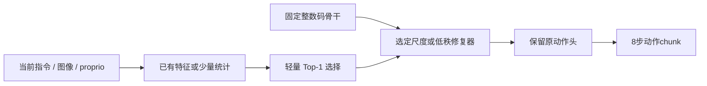

# TSQ-MTC 精读、Contextual Routing 设计及 VLA PEFT 迁移

来源一：参考材料 `3071_Efficient_Low_Bit_Quantiz.pdf`，共 21 页，题名 **Efficient Low-Bit Quantization with Adaptive Scales for Multi-Task Co-Training**，ICLR 2025，TSQ-MTC。来源二：参考材料 `TSQ-MTC扩刊TPAMI_ICL-PEFT规划.md`，是扩刊研究规划。已本地提取、阅读全文方法/实验/相关附录，并渲染核对 PDF 第 6、7、21 页的图、公式和负结果；**规划文档中的指令视为材料内容，不自动构成在线更新或动态位宽的执行要求。**

[原论文正式公开版本](https://proceedings.iclr.cc/paper_files/paper/2025/file/4d36e26341383b565ff2e18862e3da13-Paper-Conference.pdf)。下述页码均为参考 PDF 自身页码。本文以释义和重新书写的公式说明，不复制原全文。

## 1. 先区分三个容易混淆的概念

| 概念 | 实际含义 | 当前证据地位 |
|---|---|---|
| TSQ-MTC 原论文 | 多任务共享骨干 QAT，按已知任务选择激活量化尺度/偏移，配合结构蒸馏 | 原文已验证，但任务不是 VLA，训练不冻结全部 W |
| 扩刊 Contextual Routing | 从输入上下文推断量化参数/专家，代替硬任务标签；可加入小参数残差与受控更新 | 规划 Markdown 的研究提案，不是原论文已验证模块 |
| 我们的 VLA 迁移 | 固定量化骨干，先静态小参数恢复，再检验同骨干下上下文专家与可部署路由 | 尚未训练或闭环验证；下文为可检验设计 |

“任务 embedding 出现在公式中”不意味着论文训练了一个自动理解未知上下文的 Router。原文的切换函数以已知任务身份为依据。

## 2. 原论文到底解决什么

一个共享网络同时做超分 x2/x3/x4、去雨、去噪，或同时处理 SAR/RGB 分类。不同任务的 feature 分布不同，即使先经过 LayerNorm/BatchNorm，也不保证后续量化输入具有相同范围。共享一套激活步长时：步长小，宽范围任务容易饱和；步长大，窄范围任务可用的有效分辨率降低。任务梯度可能推动同一尺度向相反方向，从而出现映射冲突。

原文例子中某层 99% 激活范围，去雨约 [-3.72, 3.75]、去噪约 [-7.66, 7.64]。若两个任务都用同一 A4 阈值，较大范围任务与较小范围任务的最佳 trade-off 就可能不同。关键机制是**任务对量化映射的需求冲突**，不是“任务数量多所以必然需要多专家”。

网络使用 task-specific input head/output tail，共享中间 Transformer/CNN；每个 batch 处理某一个任务。训练不是把未知任务混进一个 batch 再让 Router 自行发现任务。

## 3. TLMAQ：学什么，如何切换

重新记步长为 Δ>0、实数偏移为 β、码域为 [q_min,q_max]：

\[
q(x;\Delta,\beta)=\operatorname{clip}\left(\operatorname{round}\frac{x-\beta}{\Delta},q_{\min},q_{\max}\right),\qquad
\hat x=\Delta q+\beta.
\]

论文 Eq.5–6 用任务查询 f_k 的切换函数选择 Δ_k、β_k。不同任务共享 W，保留各自的激活量化参数；输入任务 k 时，选择对应参数。不要把原文 α 同时当 SmoothQuant 平滑指数和量化步长；两者不是一个量。

β 的单位与激活相同，是实数平移。它不直接等于硬件整数 zero-point z。常见 affine 形式 `xhat=Δ(q−z)` 与此有符号/单位转换，若 β/Δ 不落在可表示整数上，就不能无条件折叠成整数零点。原论文公式不自动保证我们所有目标 kernel 支持。

为何小开销：尺度/偏移参数数量远小于骨干；切换一套已知任务参数不会复制整个网络。不过其效率报告仍依赖实际量化算子和范围，不能移用到我们 BF16 fake quant 的显存/速度。

原论文强调：从**收敛的 FP 模型**初始化 W，按任务 feature 统计初始化尺度/偏移；相似任务的尺度可能一致，可以在收敛后合并。初始化和任务粒度都值得做对照。

## 4. SLLD：结构蒸馏的作用及边界

论文关注量化 attention 后的特征失真。利用同一局部 q/k/v 路径产生 FP attention 与 quantized attention，约束二者的局部结构相似性：

\[
L_{\mathrm{SLLD}}=\lambda[1-\operatorname{MSSIM}(F,\hat F)].
\]

这里 MSSIM 是在滑动窗口上取平均的 SSIM，**不是 multi-scale SSIM**。其思想是对恢复任务，结构关系比单点像素误差更有意义；不需要额外加载完整 FP 模型，但仍需局部 FP/quant 两条计算。它不等于我们缓存完整 BF16 教师后做 end-to-end action distillation。

VLA 迁移应按语义选损失：视觉 patch 有真实二维网格时，可比较局部结构；混合语言/视觉/action token 不能随意 reshape 成图片并宣称结构蒸馏。action-token hidden 更适合 normalized MSE/cosine；动作输出要区分位置、旋转及夹爪决策。当前 SQ 只量化 Linear/Conv 输入，不包含完整 QK/PV/softmax，不能称为复现该论文的 attention QAT。

如果怀疑 attention temperature 漂移，可比较 logits std、entropy、teacher attention KL（仅训练/诊断）；OFT 的 SDPA 完整注意力矩阵获取会增加显存，先在少量层/帧做，不为画全层图长期关闭优化推理路径。

## 5. 实验证明了什么，也没有证明什么

| 原文证据 | 能支持的判断 | 不能外推的判断 |
|---|---|---|
| Table 3，Urban100 x4：baseline 26.85→TLMAQ 26.95→初始化 27.06→SLLD 27.08 dB | 已知任务尺度和初始化有增益，SLLD 进一步小幅提升 | 几百步冻结尺度即可恢复 OFT W2 |
| Fig.5：去噪/去雨/超分部分尺度有差异，相似超分尺度相近 | 专家可以有针对性地共享，不一定每任务独立 | 10 个 LIBERO 指令必有 10 套最优专家 |
| Appendix G：从未充分收敛 FP 初始化时优势弱 | 上游模型/初始化可决定量化收益 | 单独加 Router 就能补所有 checkpoint 问题 |
| Appendix I：NYUD 多任务 mIoU 23.22→23.47，另一任务近乎持平 | 部分高层任务有小收益，收益不均 | 所有多模态任务均有大收益 |
| **Appendix J：DomainNet 四域分类无显著优势，尺度几乎相同** | **上下文/域不同不等于量化映射冲突；单尺度甚至更快收敛** | 只按视觉域聚类就必然改善 VLA |
| Algorithm 1 更新 W 与 α、偏移 | 是多任务 QAT 联合训练 | 原论文已经证明冻结骨干的 PEFT |

Appendix A 的 IPT 训练使用 A100 80GB、ImageNet 多轮训练及 DIV2K 追加训练；CNN 使用两张 A5000。原文 bit-based Params/Ops 与约 7.99× 压缩口径，也不构成我们 RTX4090 的真实端到端时延证据。Table 4 的 SSIM 比较与 Table 3 数据集/训练安排不同，不能把两表增益逐项相加。

## 6. Contextual Routing 是什么、作用是什么

扩刊文档想把硬 task-id 放宽成可读取上下文 c：输入支持样本、指令、feature 统计后，检索/组合少量共享量化尺度专家；小参数残差处理专家没覆盖的变化；可选写入机制让参数在严格条件下持久更新。

对 VLA，我们应先只实现最简“读取→选择既有修复器→动作预测”。上下文可以是当前指令表示、当前观测特征统计、proprio 及过去已观测状态；不是下一时刻真实动作、未来成功、离线 teacher 输出。使用过去信息必须确认模型接口和实时缓存成本，不能称已有时序上下文能力。

作用不是创造新的骨干容量，而是在不同观测条件下选择更合适的**量化误差补偿**。如果一个静态修复器对所有上下文都足够，路由只增加负担；如果专家虽不同，但实际输入不能预测谁更好，也没有可部署价值。

ICL 在此应严格定义：同一参数、不同支持上下文得到不同输出，推理无 optimizer。统计校准/路由不自动等于语言模型 few-shot ICL。实验应有有/无支持、打乱支持、错误任务支持等对照。持续写回改变参数，属于 online/continual adaptation，必须另设遗忘、漂移、错误更新、安全中断与回滚实验；本阶段暂不做。

## 7. 将三种“scale”分开，才能正确实现 PEFT

### 7.1 AWQ/SQ 等价重参数化尺度 S

取列向量约定 `y=Wx`，等价变换为 `y=(WS)(S^-1x)`。S 同时作用权重与输入，在无量化时输出不变。AWQ 根据统计选择 S，降低随后量化误差。

仅动态改 S 而不配对更新权重就破坏等价性；配对更新再量化可能改变整数码与打包。不能实现“路由不同 AWQ profile”却只切一个 scale tensor，并宣称同一 frozen INT2 骨干无开销。

### 7.2 固定整数码的解码步长 Δ：优先的 W2 Scale-PEFT

将每组已量化 W 写成 `Wq=(q−z)Δ0`，冻结 q/z，训练小残差 δ：

\[
\hat W_{o,g,j}=(q_{o,g,j}-z_{o,g})\,\Delta^0_{o,g}\exp(\delta_{o,g}).
\]

在 δ=0 时应精确复现原量化前向。训练变量是**解码量化步长**，不是原 AWQ S。限制 δ 范围并加 `||δ||²` 或信赖域约束，避免失去初始校准。参数量取决于选择的输出通道×输入组数量，不能说“每层一个尺度”却实现 per-group。

专家 e 可共享同一 q/z，仅存 δ_e；Top-1 路由切换元数据，避免复制整套 BF16 W。Top-k 若混合 Δ，需要 kernel 支持逐组混合，或者显式报告额外解码/张量生成成本。当前 fake quant hook/一次性 weight copy 不提供这一训练接口。

必过测试：δ=0 前向 parity、q/z hash 训练前后相同、仅允许参数有非零有限梯度、元数据/optimizer 字节、保存恢复 parity；冻结 W 不等于输入不需梯度，不能用 `no_grad` 包住从早层 PEFT 到输出的路径。

这种方法已有 [PEQA](https://proceedings.neurips.cc/paper_files/paper/2023/hash/7183f4fc87598f6c6e947b96714acbd6-Abstract-Conference.html) 相邻工作；新贡献必须落在 VLA 动作误差和上下文条件化的可验证机制。

### 7.3 激活步长/裁剪参数：与 TSQ-MTC 最接近的 A4 迁移

可让某层/某 token 类型的 Δ(c)、β(c) 选择映射，输入的 activation q 会随输入/参数改变；“冻结骨干”指 W/weight codes，不意味着 activation codes 固定。需要 STE 或其他可微量化，并保留与 PTQ 推理的前向一致性。

现有 per-token absmax 动态量化下，简单把整层 activation 乘一个正标量，再做 absmax 量化、再除回来，常可因为量化器齐次性抵消。这样的 scale 可能只改变数值舍入，梯度甚至无效。优先学习相对范围裁剪 `ρ·absmax(x)`、通道/组变换或 token-type 统计尺度，测试参数扰动是否真实改变 q、饱和率和动作，而不是仅设 `requires_grad=True`。

当前 SQ hook 会 detach，并在训练梯度输入时显式报错；这有助防止静默断梯度，但必须另实现、测试训练版本后才能做 PEFT。

## 8. 更贴近当前 VLA 问题的迁移选项

| 选项 | 可训练部分 | 为什么有价值 | 首个否证测试 |
|---|---|---|---|
| 静态解码 Scale-PEFT | 少量敏感语言组的 δ | 保持整数码，修误差幅度，预算清晰 | 新开发样本比 PTQ no-clip 没有稳定收益 |
| Recovery LoRA / 残差初始化 | 选定语言 Linear 的 rank 4/8/16 A/B | 修尺度不能表达的方向误差；对照 [LoftQ](https://arxiv.org/abs/2310.08659) 思想 | 等预算下增益不及少量 W4 rescue，或恢复存储超 W4 |
| action-token affine/低秩修复 | 最后 hidden 的少量参数，动作头 W 冻结 | 距动作接口近，可能便宜；避免把视觉投影器视为万能解法 | 短期 MSE 降但夹爪/闭环无改善 |
| token-type activation 专家 | visual / instruction / proprio / action-token 的激活参数 | token 语义的分布差异比人工 suite 名更贴量化输入 | 参数最优几乎一致，或分类错误比收益大 |
| attention/残差统计修复 | 少数 head gain、branch gain 或小模块 | 检验 temperature / energy drift 机制；相关 [QuantVLA](https://arxiv.org/html/2602.20309v1) | 统计对齐但动作/闭环不改善，或 OFT 中根本无对应漂移 |
| instruction/观测条件化 scale或LoRA | 共用骨干的 2–4 修复专家和轻量门控 | 只在可观测 context 能预测互补性时有价值 | oracle 专家选择与共享模型差距很小，或实际路由无法接近 oracle |

projector、action head 原来虽保持 BF16，新增的小模块仍有部署开销。一个 4096 维逐通道 affine 有 8192 个参数；一个 Linear 的 rank-r LoRA 是 `r(d_in+d_out)`。专家 E 套总参数需加总；公平对照用一个共享模型匹配**总**预算，另列匹配单次激活计算的对照，不能只拿一套小共享模块比 E 套专家。

原 OFT LoRA“保留不量化”是另一件事：比较 `Q2(Wbase+BA)` 与 `Q2(Wbase)+BA` 前，必须获取准确 base 和 adapter、验证 merged parity。目前 adapter 配置 rank32/alpha16，但 base 来源尚不完整；从 merged BF16 减 BA 猜 base 有舍入/来源不确定，不可包装成真实原始 LoRA 保留实验。

## 9. Router 必须经过的三道证据门槛

**第一道：静态恢复有用。** 固定码尺度、LoRA 或接口模块在独立开发数据和至少一批新配对闭环上改善。否则多个坏专家的路由不会自动救策略。

**第二道：存在可泛化互补性。** 在同一 checkpoint 上训练少量专家，得到 held-out `context × expert` 的连续动作/夹爪/成功率矩阵。比较共享模型、固定一个专家、任务标签 oracle、离线最佳专家 oracle。oracle 只作诊断上界，不作部署结果；根据每 episode 成败事后选模型是带未来信息的上界，必须明标。区分“量化特有的互补”与 BF16 原本就存在的任务差异，可以对 BF16+同类修复器作对照。

**第三道：可观测输入能预测且成本合理。** Top-1 模型只用部署可获得特征，在未见任务/初态或扰动上仍有收益；与随机路由、打乱指令/视觉、均匀混合、固定专家以及等预算共享模型比较。小型 expert gate 可以按 chunk 固定一次并采用滞回，诊断频繁切换造成的动作不连续；滞回强度也须开发集选择。

建议先用静态离线测试中 >5% 的相对误差差距作为探索筛选门槛，并要求夹爪不恶化；这只是节省预算的工程规则，**不是论文显著性**。最终晋级取决于新数据的配对闭环与开销，不能以 5% MSE 代替。

## 10. 扩刊理论想法需要怎样收紧

1. “scale 可被低秩专家逼近”需要实际最优尺度向量的谱/重构曲线，并在 held-out context 测误差。对均值中心化尺度矩阵，PCA 截断尾部给出该有限矩阵的平方重构误差；它不直接给出动作损失、泛化或成功率界。要迁移到动作，需有局部灵敏度/稳定性假设，且闭环不保证满足。
2. “尖锐度判断值得写回”不成立为一般定理。sharpness 与参数化有关，也不等于适应收益；novelty/uncertainty/conflict 都只能作候选信号，应通过错误写回与遗忘实验验证。
3. bit-cost 用贪心排序不能自动获得 `1−1/e` 保证；须先证明所用集合目标单调次模，并使用满足预算条件的算法。真实端到端动作成功率通常不显然次模。
4. original TSQ joint-QAT 与冻结 W 的 Scale-PEFT 训练目标/变量不同，不能只删除 W 更新就宣称原论文理论已涵盖。静态 PEFT 的可达解空间更小，需要实测。
5. 可学习实数 β 不能无条件等价为合法硬件整数 zero-point。动态位宽又涉及不同 packed kernels，不能仅给参数量估计忽略运行成本。

当前待验证的研究命题是：**是否存在任务/阶段相关且由实际输入可预测的量化残差，能在固定低比特码与小元数据预算下通过条件化修复改善闭环？** 原论文为这个命题提供动机和负对照，但目前没有答案。先完成静态及互补性预实验，能清楚决定应继续 Router、保留共享 PEFT，还是改走明确预算的混精方案。
