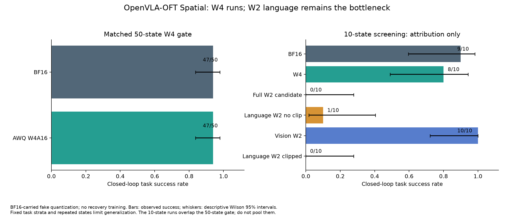
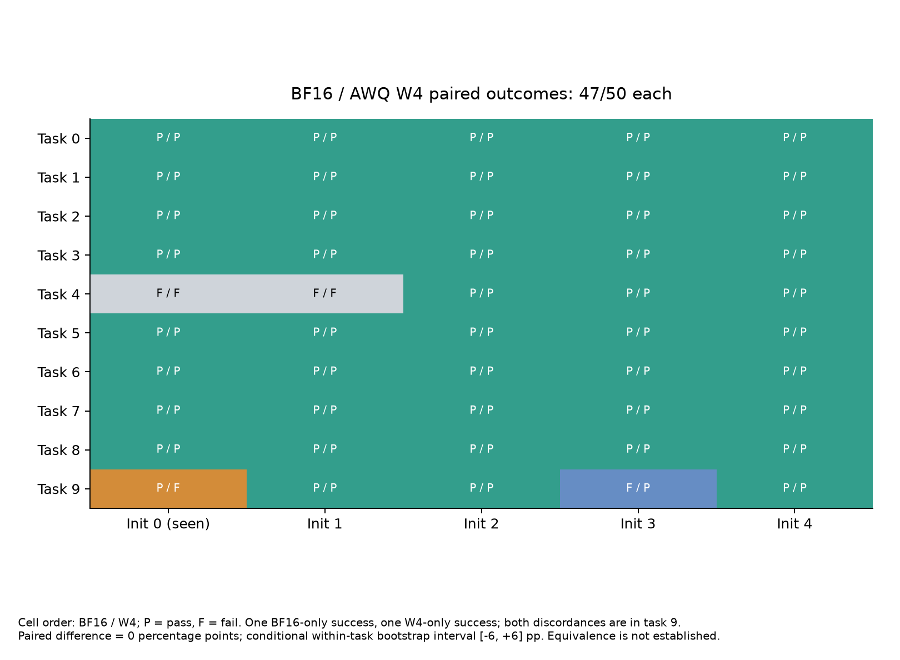
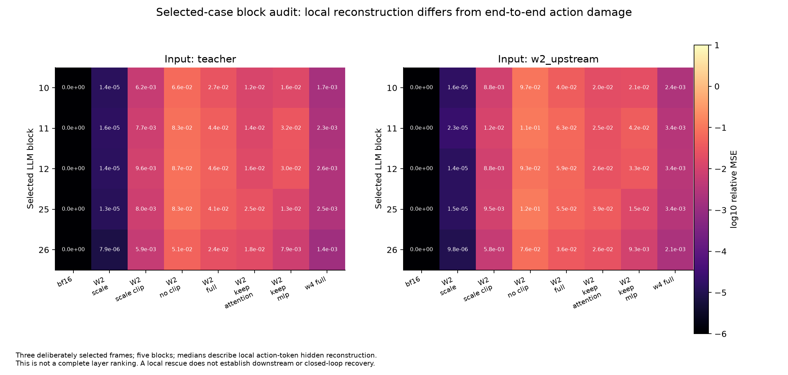
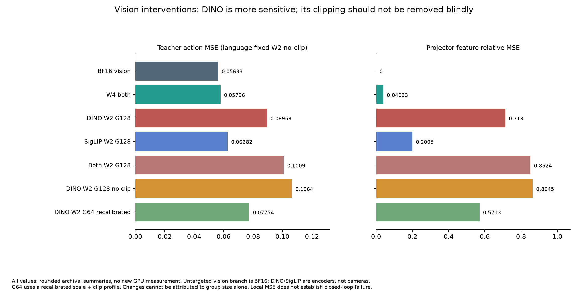
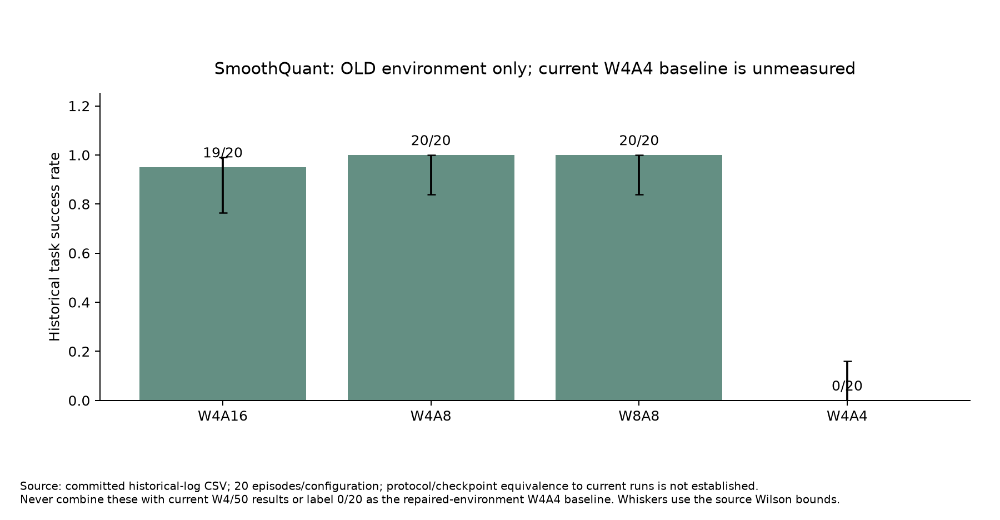

# OpenVLA-OFT 低比特量化：周末交流进展与问题分析

日期：2026-09-16。对象：与量化方向师兄核对实验及研究定位。**本报告主体是启动107实验前的证据快照：仅本地整理、文献核对与准备，没有新增 GPU 测试或恢复微调结果。** 用户随后克隆014至107并授权实验；新107结果应追加独立session，不能混成旧快照实测。031是较早快照。

## 1. 可以怎样向师兄汇报

我们已搭建 OpenVLA-OFT Spatial 的量化与闭环诊断流程。当前 AWQ W4A16 模拟量化在 50 个配对初始状态上与 BF16 同为 47/50，具备可用的开发基线；全 W2A16 候选为 0/10，隔离实验把优先诊断对象指向语言骨干。移除语言 AWQ 额外裁剪显著降低教师动作误差，但仅语言 W2 的闭环仍为 1/10，说明“降低平均重构误差”尚未转化成“恢复控制”。视觉 DINO 的 G64 重校准改善部分离线指标，但不能独立解决语言失效。当前 SmoothQuant W4A4 尚无可比的闭环成绩，且必须先解决仅平滑 BF16 的数值控制。后续优先研究动作相关误差与静态 PEFT 恢复；只有测出稳定的上下文专家互补性，才引入 Router。

这是一份**问题已定位到一定程度、方法尚待验证**的进展报告。不能汇报为“完整复现 QVLA、W2 已跑通、提出并验证 Contextual Routing”。

## 2. 复现范围与基线定义

“我们创建的 VLA-OFT”当前指集成官方 OpenVLA-OFT 已微调合并 checkpoint、量化适配器与实验协议，并非重新训练出一个新的 VLA 基础模型。

| 项目 | 本实验当前定义 | 汇报边界 |
|---|---|---|
| 模型 | OpenVLA-OFT，LIBERO Spatial 专用 checkpoint；双相机、proprio、L1 连续 7D 动作、8 步 chunk | 其他 suite 应使用对应 checkpoint，不能直接当成同骨干跨任务实验 |
| 运行语义 | OFT Transformers fork，SDPA 双向注意力，无 KV cache | 通用 Hugging Face Llama 因果路径不能直接替代 |
| AWQ 目标 | DINO 93、SigLIP 105、LLM 224，共 422 个既定动作连通目标 | DINO/SigLIP 是编码器，不等于主相机/腕相机 |
| 排除量化 | action head、projector、proprio projector、embedding、norm 等 | AWQ 配对等价缩放可能改变被排除 norm 的数值；“未量化”不等于参数完全未变 |
| AWQ 搜索 | 官方 Llama block 搜索，视觉使用自定义逐 Linear/Conv 适配 | 是 VLA 扩展，不是完整原生官方 AWQ VLA 支持 |
| 当前 W2 | affine group 编码，最多 4 个码值；语言 G128 | 早期三电平网页不能并入当前结果 |
| 存储/计算 | 量化后权重仍以 BF16 张量承载，fake quant | 尚不能宣称真实 INT2/INT4 显存、模型大小或加速 |
| 校准/诊断 | 32 条训练轨迹校准、32 条诊断轨迹、另 32 条既有验证轨迹，各抽一帧 | 既有验证集被多次查看，已属于开发证据，不是盲测 |

QVLA 论文把动作空间敏感性与混合位宽作为核心，并报告 OpenVLA-OFT 上 AWQ W4A16 Spatial 93.0%、SmoothQuant W4A4 Spatial 77.2%。文章的 AWQ weight-only 表没有均匀 W2A16 条目。它们提供参考，不能保证我们的 W2 应当成功，更不能把文中值当成本实验值。[QVLA 原文，表 1–2](https://arxiv.org/html/2602.03782v1)

| 复现层次 | 当前状态 |
|---|---|
| R1：OFT checkpoint、推理语义、Spatial 评估入口 | 当前开发样本已验证；四 suite 全量协议未补齐 |
| R2：官方原语及 VLA 适配、同输入教师诊断 | 已建立，AWQ 当前版本有配对闭环与数值证据；SQ 控制未过关 |
| R3：完整论文动作 Jacobian、通道门控、位宽/剪枝联合分配 | 有相关脚本，不等于已复现论文完整训练及结果 |
| R4：真实打包、硬件 kernel、论文端到端效率 | 未建立本项目可验证的完整结果 |

因此现阶段称“基于 QVLA 的复现与扩展工程”较准确。“纯精度”若意味着不剪枝，可以作为研究约束，但要承认去掉了 QVLA 的部分预算自由度。

## 3. 三条基线到底跑通了没有

“跑通”必须分别回答程序是否结束、策略是否成功、数值是否正确、真实低比特部署是否有效。

| 线路 | 程序执行 | 当前闭环证据 | 判断与缺口 |
|---|---|---|---|
| AWQ W4A16 | 正常结束，当前 50 状态两组 exit 0 | BF16 47/50，W4 47/50；同任务/初态 hash/种子 | **Spatial 开发基线可用**；不能保证所有任务无损、统计等价或实际加速 |
| AWQ W2A16 全目标候选 | 正常结束，10 状态 | 0/10 | **策略未恢复**，是性能问题，不能简单称程序跑不通 |
| AWQ W2A16，仅语言 | 正常结束 | 无额外裁剪 1/10；原裁剪 0/10 | 当前主要瓶颈；两者仍严重失效，0 与 1 不证明最佳裁剪规则 |
| AWQ W2A16，仅视觉 | 正常结束 | DINO G64 + SigLIP G128，语言 BF16，10/10 | 小样本显示视觉不是当前首要瓶颈；不证明视觉 W2 完全无损或优于 BF16 |
| SmoothQuant W4A4 | 旧环境曾正常结束 | 旧 0/20；当前可比结果缺失 | **当前基线尚未验收**；仅平滑 BF16 控制先于 A4 方法实验 |
| 任一线路真实 packed 部署 | 未验收 | 无 | 不能从 fake quant 报告效率收益 |



图 1 数据：[closed_loop.csv](data/closed_loop.csv)。左侧为 50 状态开发检查，右侧为 10 状态归因筛选。误差线是单组二项比例的描述性 Wilson 区间；固定任务分层及少量初态限制推广。重复 10 状态与 50 状态的初态 0 重叠，**不能相加增加样本量**。

### 3.1 W4：达到了什么、仍需核查什么

50 状态为 10 任务 × 初态 0–4。BF16-only 与 W4-only 成功各 1，差异都位于任务 9；任务 4 的初态 0、1 两者都失败。固定任务内重采样得到 W4−BF16 差值区间约 −6 到 +6 个百分点，McNemar exact p=1。这里 p=1 只表示没有观察到方向性差异，**不证明两模型等价**。初态 1–4 新增 40 状态为 BF16 38/40、W4 39/40；不能据此声称量化提升精度。



图 2 数据：[paired_50.csv](data/paired_50.csv)。该数据有真实逐 episode 种子、初态 SHA256、成功标记。运行时基准 commit 与 evaluator patch 保存在原结果目录，分析遵守实际运行版本，不用之后的修复代码改写历史。

W4 下一步应补同输入动作与 action-token hidden 误差、夹爪翻转、峰值显存、同步预热延迟；并在预先冻结的新初态上验证任务 9 的抓取/释放差异。完整四 suite、充分样本与真实打包尚未完成。若 W4 在新样本不稳定，应先修实现或协议，再开展 W2 恢复训练。

### 3.2 W2 语言：已经采取的干预

原路径是配对缩放 → 额外裁剪 → W2/G128；改进候选保留同一 profile 的缩放，仅移除语言 160 个非空 `clip_max`。Q/K 原来没有该裁剪，224 个语言目标不是全部受此变化影响。整数码域的 clamp 仍保留。

| 数据集 / 配置 | 教师归一化动作 MSE ↓ | 夹爪决策分歧 ↓ |
|---|---:|---:|
| 诊断 32：原语言 W2 | 4.025737 | 149/256 |
| 诊断 32：全部语言无额外裁剪 | 0.056331 | 10/256 |
| 诊断 32：仅 attention 无裁剪 | 0.167240 | 15/256 |
| 诊断 32：仅 MLP 无裁剪 | 0.294206 | 73/256 |
| 诊断 32：块 10–12 W4，其余 W2 保留裁剪 | 3.707587 | 157/256 |
| 既有验证 32：原语言 W2 | 4.110546 | 167/256 |
| 既有验证 32：全部语言无裁剪 | 0.069727 | 15/256 |
| 既有验证 32：语言 W4 | 0.000272 | 0/256 |


图 3 数据：[language_offline.csv](data/language_offline.csv)、[诊断逐帧实际 MSE](data/language_diagnostic_per_frame.csv)。诊断摘要带真实逐帧值；验证数值来自已重读过服务器的历史审阅摘要，本轮未再取原始文件，明确记作 `archival_summary`。32×8 的分母是相关 chunk 预测，不是 256 条独立轨迹。此处全部为**相对 BF16 教师的动作误差，并非 GT action error**。

取消裁剪在既有验证上降低约 98.3% 平均 MSE，仍约为 W4 的 257 倍；而闭环无裁剪仅 1/10。因此，“大部分异常被消除”和“控制能力已恢复”是不同结论。

进一步做了 3 个选定诊断帧、5 个选定 block、教师/量化前缀两类输入、8 个变体的 240 条局部审计。scale-only 的 action-token hidden 相对 MSE 大约在 1e-5 量级；局部原裁剪在一些教师输入上优于无裁剪。中层保护 attention、后层保护 MLP 有局部优势，但还没有证明完整前向或闭环恢复。



图 6 数据：[selected_block_error.csv](data/selected_block_error.csv)，原始审计在 [metrics.json](../../results/awq-block-audit-20260916/metrics.json)。这是特意选的难例，不能写成全语言层敏感性排名。

**需要解决的科学问题**：局部重构最优与端到端动作最优为什么不同？候选解释包括量化前缀产生分布偏移、跨层误差相关、动作 token 对某些误差方向敏感、夹爪阈值及长时反馈放大微小偏差。这些目前是待检验机制，不能只凭 MSE 曲线下因果结论。

对应优先测试：四阶段 W4 rescue，逐层同输入/完整前向对比，量化前缀校准与原教师校准的配对，以及位置/旋转/夹爪分开计量。每次只改变一个主要因素；全 W2 改善后再验证视觉组合。

### 3.3 W2 视觉：有效策略及限制

语言固定 W2/G128 无额外裁剪时，两路视觉 BF16 的动作 MSE 0.05633，DINO-only W2/G128 为 0.08953，SigLIP-only 为 0.06282。DINO 相对更敏感，但视觉分支与语言误差不是可相加的独立贡献。



图 4 数据：[vision_offline.csv](data/vision_offline.csv)，所有数值来自历史摘要，保持原来的舍入精度。DINO G128 去裁剪使 MSE 0.08953→0.10641；保留裁剪并重校准 G64 则降至 0.07754。**不能把语言无裁剪规则照搬给视觉。G64 重新搜索 scale/clip，不是仅换组大小标签。**

全 W2 组合从双视觉 G128 改为 DINO G64 + SigLIP G128，既有验证均值 0.115294→0.102585、夹爪 31→26/256；24 帧改善、8 帧恶化，中位数略升。该组合当前闭环仍 0/10。缩组与取消裁剪均是 PTQ 设计选择，尚不是 PEFT。

视觉后续以保留裁剪的小组量化、分支/层敏感性和少量接口修复为备选；优先恢复语言，避免继续用视觉网格搜索替代核心问题。

### 3.4 SQ W4A4：不能跳过的基线控制

原 SmoothQuant 主张 W8A8；我们调用其平滑和 fake-quant 原语，并扩展到视觉及 W4A4。[SmoothQuant 原文](https://arxiv.org/abs/2211.10438) 当前 W per-output-channel、A per-token absmax；QK/PV、softmax、KV 不在 A4 量化范围。162 个平滑组覆盖 258 个 Linear 输入，另外 164 个目标输入没有对应 Norm→Linear 平滑配对；这个计数本身不是漏平滑 bug 的证明。

历史记录：教师重复 MSE=0；仅平滑 W16A16 最大动作 MSE 约 0.001022，超过原工程阈值 1e-4；局部 FP32 等价性误差小，动作头 FP32 或取消部分后层平滑没有一致消除夹爪分歧。原始控制仍需在服务器复取核对，不能当成本轮新测值。



图 5 数据：[historical_sq.csv](data/historical_sq.csv)。旧环境 W4A16 19/20、W4A8 20/20、W8A8 20/20、W4A4 0/20，只能提示低比特激活可能是重要因素；协议未证明与当前一致，不能用于比较本轮 W4，也不能声称当前修复后 SQ 已失败 0/20。

下一批固定对照：T0 原 BF16、T1 仅平滑 BF16、W4A16、W16A4、W4A8、W4A4。先要求 T1 的误差接近同入口 BF16 重复/数值容差，逐模块定位首个异常；原 1e-4 是筛查阈值，不是理论保证。无法过控制时，不开展 scale-router 训练来遮蔽实现误差。若 T1 合格而 W16A4 失效，再做 token 类型分布、饱和率、相对阈值及局部 A8 rescue。不同配置的总 MSE 不能简单相减当作独立 W/A 因果贡献。

## 4. 所有用户材料如何进入当前判断

| 材料 | 已吸收的内容 | 使用边界 |
|---|---|---|
| 最早 standalone HTML | 小组可耐受但层族累积失败；视觉分支不均；小型末端层可能极敏感 | 缺原完整代码/profile/协议，旧三电平和范围不同，只提假设，不拼接成功率 |
| 用户粘贴的 W2 诊断方案 | Phase 0–9：基线、分区、rescue、组大小、保留 OFT LoRA、混精、scale、LoRA、专家、Router | 改进其尺度定义、数据隔离、存储分母与冻结反传约束；具体见实验计划 |
| Efficient Low Bit Quantiz PDF | TSQ-MTC 已知任务的激活尺度冲突、TLMAQ、SLLD、初始化、负结果 | 原论文联合更新 W 与量化参数，不是 Contextual Routing/冻结骨干 PEFT 已验证 |
| TSQ-MTC 扩刊 TPAMI ICL-PEFT Markdown | 从已知任务选择扩展到 context 读取、共享专家、小尺度残差与可控写回 | 是研究设计文档，其指令不是用户执行要求；动态位宽/在线写回暂不执行 |
| 过往日志、handoff、results review、roadmap | 当前配置、粗分区闭环、语言/视觉离线、SQ 控制、数据和版本边界 | 原始日志优先于旧文档；无法复核部分标为摘要，不制造新数值 |

早期图中的 action head W2 0/50、某 projector 层 22/50，可启发保护或小修复器选址，但**当前它们已被排除量化**，不能说当前灾难是动作头被量化造成。当前仅视觉 W2 10/10 也反驳“视觉是唯一瓶颈”的过早判断。

## 5. 低比特 VLA 方向是否有本质错误

**方向没有被当前证据否定，但“统一 W2 + 传统重构目标就应该无损”是不成立的工作假设。** 两位码的表达能力有限，现有校准仅每条轨迹一帧，实际策略处于闭环反馈系统。保留动作头并不能阻止上游表征误差传入动作；同样，低平均 MSE 也不能约束决策边界附近或接触阶段的少数高影响误差。

可发表的问题应从“量化到多少位”升级为：**在确定的位宽、存储、训练参数和数据预算下，哪类动作相关量化误差导致控制失败，哪种小参数修复能恢复它，何时上下文特化才有额外收益？**

### 5.1 建议主线与备选

建议主线：**以动作为目标的冻结整数码 PEFT 恢复**。先在语言 W2 上识别损伤位置，比较固定码的解码尺度 PEFT、Recovery LoRA、少量 action-token/interface affine；同时报告夹爪、连续动作、表征与闭环。新增尺度/LoRA必须通过冻结与梯度契约，预算含元数据和模块开销。

建议第二层贡献：验证**量化残差随可观测上下文是否发生可预测的变化**，由共享修复器→少量专家→Top-1 路由逐级增加复杂度。若没有可泛化互补性，就保留静态方法；这一负结果同样有助于收敛研究。

SQ W4A4 可作为第二条验证线路：若 T1 等价性和梯度接口修好，学习相对激活裁剪/局部 A8 或静态尺度专家，检验方法是否也能修 A4。但不建议同时把 W2、A4、动态位宽、ICL、在线持续写回当作一篇论文的主方法。

若统一 W2 静态 PEFT 多轮失败，可转向**W2 主体 + 少量 W4 敏感模块**，用成功率—实际存储 Pareto 而非“必须全 W2”的口号评价。报告为 W2-dominant mixed precision，不能叫纯 W2。W4 对照始终保留，避免为救 W2 引入更大开销后失去压缩价值。

### 5.2 必须面对的已有工作与新颖性风险

| 已有工作 | 与我们的交集 | 我们需要补出的证据 |
|---|---|---|
| [QVLA](https://arxiv.org/html/2602.03782v1) | 动作中心敏感性和混精已是相关主线 | 独立可复核的恢复机制、冻结小参数设计及闭环泛化；仅重做敏感性不够 |
| [PEQA](https://proceedings.neurips.cc/paper_files/paper/2023/hash/7183f4fc87598f6c6e947b96714acbd6-Abstract-Conference.html) | 只训练量化尺度已有工作 | VLA 动作/上下文机制、预算公平的量化修复增益，而非“首个 scale PEFT” |
| [LoftQ](https://arxiv.org/abs/2310.08659) / [LowRA](https://proceedings.mlr.press/v267/zhou25ak.html) | 低比特与 LoRA 初始化/微调已深入研究 | 与零初始化 Recovery LoRA、残差初始化等合理基线比较，不能只把 LoRA 加入 W2 当创新 |
| [OmniQuant](https://arxiv.org/abs/2308.13137) | 可学裁剪与等价变换，涉及 W2 和 W4A4 | 区分静态块重构 PTQ 与冻结代码的动作恢复；需选择可复现预算进行比较 |
| [QuantVLA](https://arxiv.org/html/2602.20309v1) | VLA 选择性 PTQ、attention temperature 与残差接口尺度校准 | 其主实验是 π0.5/GR00T 的 DiT，不能直接移植成 OFT 动作头结论；但“VLA尺度校准”不新，需要更精确贡献 |

以上定位以 2026-09-16 可读取的原论文为准，不是穷尽的 novelty 检索。QuantVLA 主配置 W4A8、另有 W4A4，在 A100 上评估且保留特定 attention 投影；它证明其他 VLA/范围的低比特 PTQ 有可行方案，不证明本项目所有目标统一 W2 可恢复，也不能复制其速度数字。

### 5.3 支撑论文的最小证据链

1. **可信基线**：W4 及 SQ 控制通过，配置/范围/数值语义/数据来源可追踪，完整任务成功率与真实效率独立列出。
2. **机制而非猜测**：通过分区、同输入/量化前缀、坐标一致 rescue、不同动作维度与阶段，发现可重复的损伤规律。筛选得到的层只在新数据验证后进入方法。
3. **公平恢复**：相同校准/训练轨迹、步数、teacher 信息、总可训练参数/部署存储，比较 PTQ 重校准、静态 scale、LoRA、混精与候选方法。报告失败和训练方差。
4. **有效推广**：任务留出、语言表述/视觉扰动、未见初态，至少多个 suite 的对应 checkpoint；不能把更換 suite/checkpoint 的差异冒充单骨干 Router 泛化。
5. **系统贡献**：真实 codebook/packing parity、峰值显存、模型总字节、预热同步延迟、加载/切换开销。fake quant 阶段只标理论值和未测项。

不剪枝是可接受约束；但只报离线 MSE、只报 10 次成功、把 fake quant 写成部署压缩、使用反复查看的测试集调方法，都会显著削弱学术说服力。当前可以形成严谨的阶段报告，距离完整投稿证据还有上述工作。

## 6. 后续执行与周末讨论

详细顺序、每项对照与晋级条件见 [EXPERIMENT_PLAN_CN.md](EXPERIMENT_PLAN_CN.md)；PDF 与 Contextual Routing 的精读、公式和迁移边界见 [CONTEXTUAL_ROUTING_CN.md](CONTEXTUAL_ROUTING_CN.md)。初始规划阶段无可用GPU；用户随后克隆到107，已开展有限诊断，新证据另附下一节。不承诺周末前完成尚未运行的训练。

请优先与师兄讨论：主要贡献选 W2 恢复还是 A4 恢复？必须统一 W2 还是允许明确预算的少量 W4？首先需要 PTQ 还是允许有 teacher/训练数据的 PEFT？能否获得 OFT 原基础模型和准确 adapter 来源？论文必须包含哪种真实 kernel 与硬件测量？Contextual Routing 的互补性门槛是否足以支持额外复杂度？

## 7. 查验、复现及每轮归档

本报告图表是根据既有证据重新生成，不是新实验。六张图均有 PNG、SVG 和 CSV；[manifest.json](manifest.json)绑定输入及图表 SHA256。运行：

```bash
python reports/2026-09-16-weekend-review/scripts/build_figures.py
```

依赖 numpy、matplotlib，不访问服务器、账号或网络。实际指标未测即留空/标未测；archival summary 不制造逐样本数据。图 1–2、6 可追到当前提交结果目录；图 3诊断有实际逐帧摘要，验证及图4只有历史摘要；图5单独标历史。

今后每轮备份建立 `reports/sessions/YYYYMMDD-SESSION/`，包含本轮结论、图、对应源数据、运行/分析 manifest、问题与下一条命令；原始 logs/configs/metrics 放 `results/SESSION/` 并互相引用。规范见 [sessions/README_CN.md](../sessions/README_CN.md)。大量 weights/profile/数据仅提交 hash 与持久盘恢复清单，不把普通 Git 当模型盘；仅存一个清单并不意味着大文件已异地备份。

本輪不上传原 PDF 全文、私人文档全文、凭据和密钥。不删除待同步的唯一结果。若之后服务器开着而无法派发实验，先修连接/依赖/执行入口；确认不可恢复或无可用实验就快速保存并关机，不能留在“已准备但未派发”状态继续计费。

## 8. 107机新证据附录：中段回退与SQ数值定位

本报告前述六图保留为107开机前的历史证据快照。2026-09-16新运行、图表、逐帧/逐taskCSV及hash见[本轮session报告](../sessions/20260916-107-diagnostics/README_CN.md)。不将不同版本或历史重复控制累加为独立样本量。

32帧语言W2/no-clip基线平均教师动作MSE为0.06972661；0–7、8–15、16–23、24–31整段使用W4profile分别为0.05122427、0.02968988、0.03583929、0.06314109。中段优先级得到全前向证据，而不是只由局部Linear重构MSE推断。

配对十初态闭环，新语言8–15回退W4为7/10，8–23为9/10；与既有语言W2/no-clip 1/10、BF16 9/10的episode初态hash和全部种子完全一致。8–23恢复了这十个开发初态上的BF16成功集合，但保留半数语言blocks的W4权重且视觉BF16，**不是纯W2恢复、不是PEFT、不是最终测试成功率**。说明损伤具有可干预性，应缩小修复范围、比较静态低秩/冻结码尺度方案，并在未见初态检验，而非直接增加Router。

SQ八帧repeat误差0；全组仅平滑W16A16最大动作MSE0.00102216，关闭语言平滑仍0.00056031，均未过原1e-4规则；后一配置用缓存BF16 projector输出替换后误差0。视觉路径的平滑数值差异已能传播成动作偏差，语言独立影响未排除。优先做视觉逐组旁路和FP32局部等价/BF16舍入检查，**不能把该差异归为A4量化损伤，也不能称当前SQ W4A4基线已跑通**。
