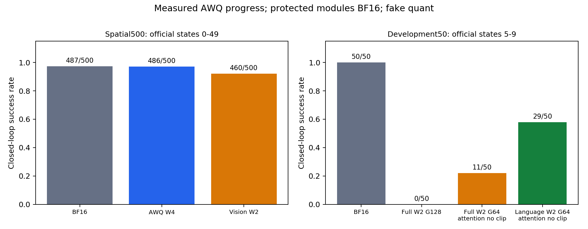
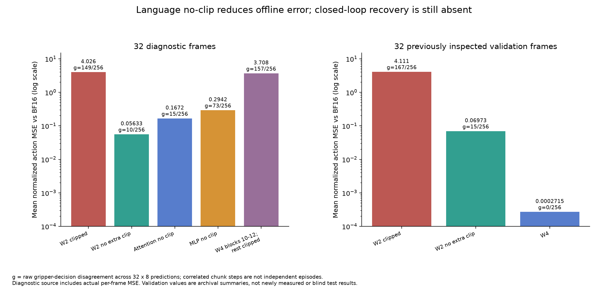
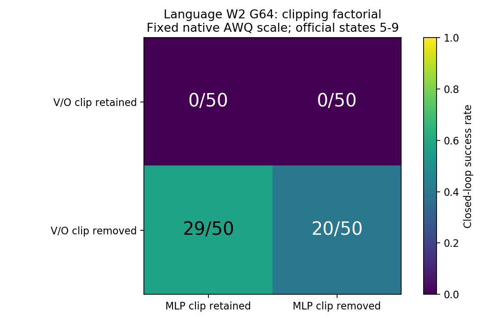
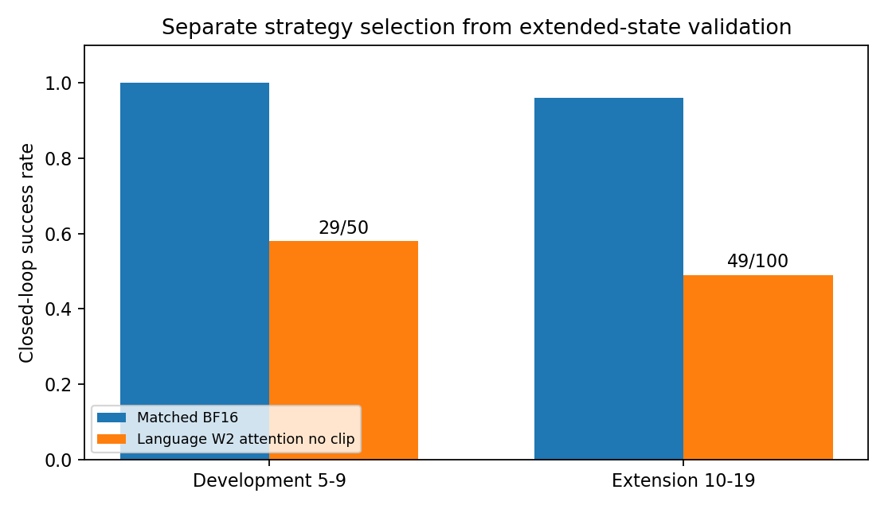
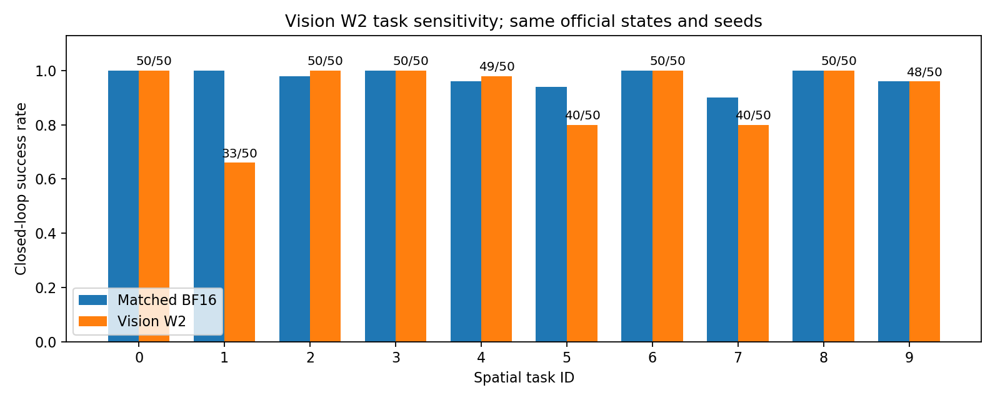
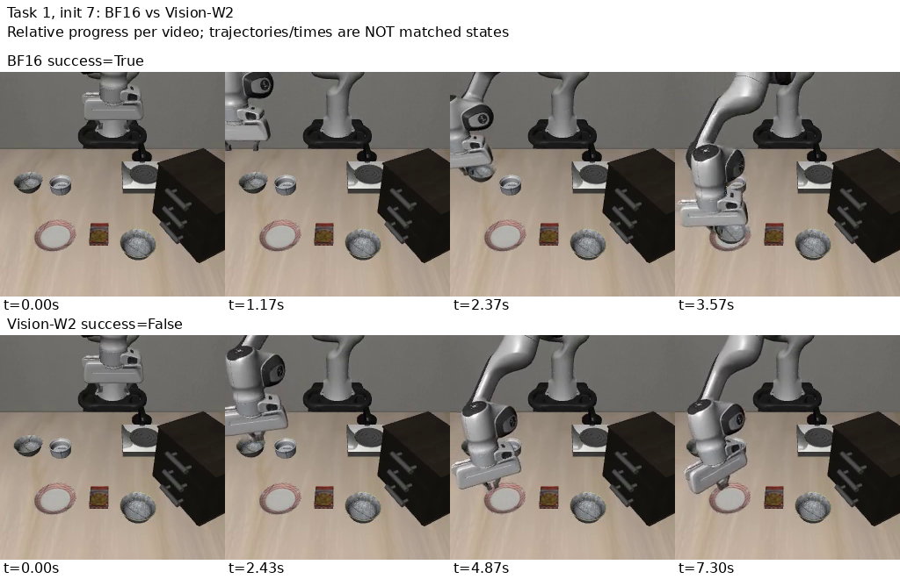
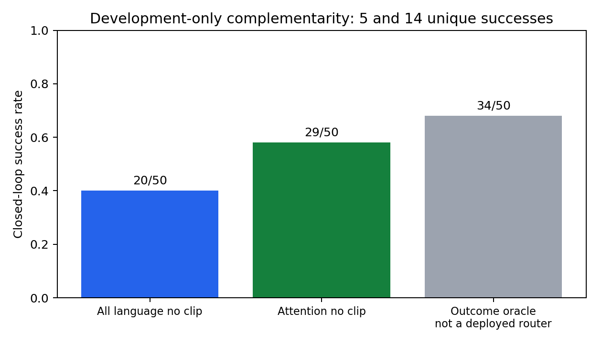
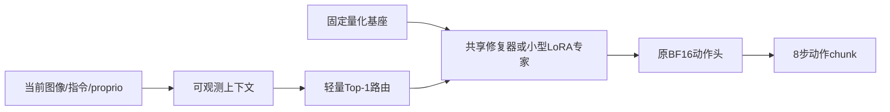

# OpenVLA-OFT 低比特量化：实验进展与研究分析

更新：2026-09-18。用于个人实验进展备份与后续研究规划。本文整合已取回的原始日志、配对结果和历史审阅摘要；本次整理没有启动服务器或新增 GPU 实验。

本目录仅保留三个文件：[汇报总结](汇报总结.md)、[按实验名称组织的实验日志](实验日志.md)、[结果数据与来源哈希](结果数据.json)。图片引用仓库内的实测图表；旧版完整报告、CSV 和制图脚本保存在[历史归档](../2026-09-16-weekend-review-archive/)，各轮原始日志保存在 `results/`，详细报告保存在 `reports/sessions/`。

## 一、目前能确认什么

**AWQ W4A16 已通过当前 Spatial500 的闭环基线验证；完整 W2A16 尚未恢复为可用策略；当前 SmoothQuant W4A4 基线尚未通过验收。** W2 的语言剪裁干预和中段精度保护有实际效果，但前者恢复有限，后者属于混合精度。低秩补偿已有初始化预实验，尚未完成梯度训练或 PEFT 闭环验证。Contextual Routing 具备可检验动机，但没有训练结果。

| 线路 | 已测结果 | 阶段判断 |
|---|---:|---|
| BF16 正式参考 | 487/500，97.4% | 当前 Spatial checkpoint 的配对参考 |
| AWQ W4A16 | 486/500，97.2% | 与 BF16 相差 −0.2 个百分点，可作为当前主对照 |
| 仅视觉 AWQ W2，语言 BF16 | 460/500，92.0% | 比 BF16 低 5.4 个百分点，视觉 W2 不能视为无损 |
| 仅语言 W2 G64、仅注意力撤销额外剪裁 | 开发 29/50；扩展 49/100 | 部分恢复；两批对应 BF16 为 50/50、96/100 |
| 完整连接目标 W2 原始 G128 | 0/50 | 程序正常，策略严重失效 |
| 完整连接目标 W2 G64、注意力撤销剪裁 | 11/50，22% | 组合方案部分恢复，仍远低于 BF16 50/50 |
| 语言 blocks 8–23 回退 W4，其余语言 W2，视觉 BF16 | 开发 48/50；对应 BF16 47/50 | 可恢复的混精诊断参照，不能称均匀 W2 或 PEFT 成果 |
| SQ W4A4 | 当前同协议成绩未认证；旧环境记录 0/20 | 先处理 W16A16 仅平滑数值控制，旧记录不并入当前比较 |
| PEFT / Contextual Routing | 梯度训练及路由闭环均未测 | 只有初始化容量探针与开发集互补性诊断 |

图 1：左侧三个配置均覆盖官方初态 0–49 的固定 Spatial500；右侧均为初态 5–9 的开发 50 回合。两侧样本不同，不能横向当成同一批次比较。源数据来自[正式500汇总](../sessions/20260917-107-baseline-continuation/data/summary.json)和[最新 scope 汇总](../sessions/20260918-107-awq-continuation/data/scope_summary.json)，同时完整收录于本目录结果数据。

### 评估范围与复现边界

- 模型为官方 OpenVLA-OFT 已微调合并的 LIBERO Spatial checkpoint，并非本项目重新训练了一个 VLA 基础模型。双相机输入、proprio、连续 7D 动作、8 步 chunk；推理采用 OFT 分支的双向 SDPA 注意力语义，无 KV cache。
- 422 个既定动作连通量化目标包括语言 224、DINO 93、SigLIP 105。DINO/SigLIP 是两个视觉编码器，不是分别代表主相机和腕相机。语言主干还处理融合后的视觉和动作 token，不只是文字编码器。
- action head、projector、proprio projector、embedding、norm 等保持非低比特量化；AWQ 配对缩放仍可能改动相关 norm 数值。“完整 W2”在本文仅指全部既定连接量化目标，不能宣称整个模型所有参数均为 2bit。
- 正式 Spatial500 是 **10 任务 × 50 次 rollout**，不是 500 个训练 epoch。配对核验初态编号、初态 SHA256、模型/环境种子与 checkpoint。多个对照重用同一批起点；历史 10/50 与正式 500 的重叠数据不相加。
- 权重先模拟量化后仍以 BF16 张量存储，激活为 BF16/A16；没有验收 packed INT2/INT4 kernel。实际模型字节、显存节省、加速与多套件泛化均未测。当前不能称完整复现 QVLA 的所有实验。

[QVLA 原文](https://arxiv.org/html/2602.03782v1)是动作中心敏感性与混合位宽的参照；文中的结果不替代本项目测量，也不意味着统一 W2 必然可行。本文涉及文献的定位沿用此前原文核对，不声称已经完成穷尽的新颖性检索。

## 二、AWQ-W4 基线验证：主线已经有一个可靠阶段参照

正式 500 回合由有限分片补齐，覆盖每任务官方初态 0–49，没有将旧开发 50 直接拼入。BF16 487/500，W4 486/500；0 程序异常、退出码 0；500 条配对 manifest 一致。两配置共 13,426 次策略查询均 finite。

配对成功集合为：共同成功 477、共同失败 4、BF16 独有成功 10、W4 独有成功 9。McNemar exact p=1，说明这批样本未观察到方向性差异，**不证明统计等价、所有任务无损或更换随机种子仍稳定**。

图 2：[逐任务和逐回合源数据](../sessions/20260917-107-baseline-continuation/data/)。总体接近不等于逐案例一致，19 个成功结果不同的案例应与视频一起复核。旧开发 50 的 BF16/W4 同为 47/50，以及另一十初态 W4 为 8/10，属于历史开发证据，不与正式 500 累加。

后续可以用该 W4 recipe 作为 AWQ 恢复方法的 sanity 对照。仍需使用各 suite 对应 checkpoint 扩展到其余 LIBERO 套件，并补多种子、固定输入动作回放及真实打包 parity。当前 20GB 空余盘能继续这类小产物实验，不能一次容纳约三份额外 15GB checkpoint；不自动下载全部模型或扩容。

## 三、AWQ-W2 语言：剪裁是重要因素，但不是全部问题

### 1. 离线诊断及已做干预

历史语言 W2/G128 原路径是配对 scale → 额外权重剪裁 → affine group W2。撤销额外 `clip_max` 保留整数码域的 clamp，并不变成“完全不限制量化范围”。Q/K 原来就没有这类剪裁；160 处非空剪裁分布于注意力 V/O 64 处和 MLP 96 处。

| 数据与配置 | 平均教师动作 MSE ↓ | 夹爪分歧 ↓ | 证据 |
|---|---:|---:|---|
| 诊断32：原语言 W2/G128 | 4.025737 | 149/256 | 实际诊断摘要 |
| 诊断32：全部语言无额外 clip | 0.056331 | 10/256 | 同输入干预 |
| 诊断32：仅 attention 无 clip | 0.167240 | 15/256 | 同输入干预 |
| 诊断32：仅 MLP 无 clip | 0.294206 | 73/256 | 同输入干预 |
| 既有验证32：原语言 W2 | 4.110546 | 167/256 | 历史审阅摘要 |
| 既有验证32：全部语言无 clip | 0.069727 | 15/256 | 历史摘要；后续诊断引用同参照 |
| 既有验证32：语言 W4 | 0.000272 | 0/256 | 历史审阅摘要 |

图 3：[原数据与证据标记](../2026-09-16-weekend-review-archive/data/language_offline.csv)。诊断有实际逐帧记录；无法复取的既有验证摘要标 `archival_summary`，不补造逐帧值。这些是相对 BF16 教师的归一化动作误差，**不是相对 GT action 的误差**。32×8=256 是相关 chunk 动作步，不是 256 条独立轨迹。

### 2. 闭环扩大后，离线最优规则并不等于闭环最优

下表均为相同官方初态 5–9 的 50 回合，仅语言量化、视觉 BF16，对应 BF16 50/50。

| 组大小与额外剪裁 | 成功/50 | 判断 |
|---|---:|---|
| G128，原剪裁 | 0 | 严重失效 |
| G128，全部语言无 clip | 8 | 有限恢复 |
| G64，原剪裁 | 0 | 缩组/重搜索本身不足 |
| G64，全部语言无 clip | 20 | 比 G128 改善，但仍不可用 |
| G64，仅注意力 V/O 无 clip、MLP 保留 | 29 | 当前开发集最好静态候选 |
| G64，仅 MLP 无 clip、V/O 保留 | 0 | 撤销 MLP 剪裁不能绕过 V/O 损伤 |

图 4：[四格 JSON](../sessions/20260918-107-awq-continuation/data/language_clip_factorial.json)。G64 四格保留同一原始 profile 的 scale、校准与其他字段，仅撤销指定 clip；CPU 逐字段/tensor 相等核验通过。G128 与 G64 来自不同搜索 profile，因此其对比同时包含组大小及搜索参数变化，不能解释成单独的组大小因果效应。

注意力方案随后扩展到官方初态 10–19：49/100，BF16 96/100。开发 29/50 与扩展 49/100分开记录。这里“新初态”仅是该配置此前未测过的官方起点；已存在 BF16/W4 参考，不是全项目独立盲测。

图 5：[分批源数据](../sessions/20260918-107-awq-continuation/data/language_attention_splits.json)。这说明改进在扩展起点仍能部分完成任务，但差距达 47 个百分点。不能把“成功了若干回合”称为 W2 基线已经可用。

### 3. 可能机制与下一项验证

现有结果支持：额外剪裁与 2bit 离散化共同作用，传统局部重构目标可能不适合 OFT 的动作输出；并不支持“所有语言层都必须不剪裁”。仅注意力撤销优于全部撤销，提示 MLP 可能仍需要约束。

待验证解释包括量化前缀输入分布偏移、跨层误差相关、动作 token 对特定误差方向的敏感性、夹爪阈值以及接触阶段闭环放大。现有选定 3 帧/5 blocks/两类前缀/8变体的 240 条局部审计和 scale-only 约 1e-5 相对 hidden MSE，不构成全层排名或根因证明。后续应做固定图像/proprio 回放、动作维度与阶段分解，并直接比较教师前缀和真实量化前缀校准。

## 四、AWQ-W2 视觉与完整量化：小样本判断已经被修正

### 1. 视觉仅 W2：500 回合证明有实质损失

当前 recipe 为 DINO G64 + SigLIP G128，语言 BF16。历史 5–29 为 230/250，本轮 30–39 为 94/100、40–49 为 91/100、0–4 为 45/50，合计唯一 460/500。对应 BF16 487/500。各分片 0 异常、退出 0、manifest 匹配、profile/evaluator contract 相同。

BF16 独有成功 37、视觉 W2 独有成功 10、共同成功 450、共同失败 3。精确 McNemar p≈9.85×10⁻⁵，仅描述固定任务/种子的探索性配对差异，不代表多个任务套件的推广，也没有进行多重比较校正。

图 6：[逐任务 CSV](../sessions/20260918-107-awq-continuation/data/scope_per_task.csv)。task1 为 33/50 对 BF16 50/50；task5 为 40/50 对 47/50；task7 为 40/50 对 45/50。task0/2/3/6/8 为 50/50。下降具有任务集中性，不是所有视觉案例失效，也绝非视觉 W2 无损。视觉约占既定连接目标权重 9.6%，仅量化视觉的成功率不能证明主要语言权重压缩可行。

图 7：真实视频的配对抽帧示例；相应目录记录 SHA、fps、帧索引与时间。350 回合快照中 33 对结果不同的视频不等于最终 500 的全部 47 对。已查看 task1 初态7/8/14，候选夹爪移向盘子但碗未完成搬运；可优先核查抓取/运输链路，不能据抽帧区分空夹、滑脱、定位偏差，更不能直接归因到某一层。两条闭环轨迹会分叉，归一化时间不代表相同输入状态。

### 2. 视觉自定义 AWQ 适配与历史离线措施

官方 AWQ 利用配对通道缩放降低量化误差：列向量约定下，`Wx=(WS)(S⁻¹x)`。重要通道在量化前被放大，但输入有对应逆缩放，浮点函数才保持等价；不是单独增大权重获得更强响应。

语言采用官方 Llama block 搜索；视觉适配按 Linear/Conv 的输入通道组织激活统计和 scale/clip 搜索，并配对执行缩放。原理相通，但搜索评估单元、模块拓扑及卷积通道布局不同。逐模块重构误差更低，不保证整视觉编码器、跨模态接口与动作误差更低。

历史离线 DINO W2/G128 取消 clip 使教师动作 MSE 0.08953→0.10641，保留 clip 且 G64 重校准为 0.07754。双视觉从 G128 改为 DINO64/SigLIP128 后，既有组合验证 MSE 0.115294→0.102585、夹爪分歧 31→26/256，但中位数略升且旧闭环仍 0/10。这些保留为历史摘要；缩组与重校准是 PTQ，不是 PEFT。

### 3. 完整 W2：改进并未合成可用策略

同开发初态5–9：原始全连接 W2 G128为0/50；全连接 G64加注意力无额外clip为11/50；对应BF16为50/50。后者视觉SigLIP也是G64，区别于已扩大验证的视觉D64/S128。两配方还改变了搜索profile与剪裁，不能把11次恢复仅归因于注意力规则。

下一项最有价值的 AWQ 测试是固定语言注意力方案，逐一比较视觉 BF16、DINO-only W2、SigLIP-only W2、D64/S128 与双 G64，使用同批起点。组合 profile 必须核验 checkpoint、block scale、输入缩放的兼容性和422目标完整性，不能盲目拼接。先隔离附加损失，再决定微调位置。

## 五、中段精度保护：损伤可干预，但恢复代价不小

语言主体 W2/G128无额外clip、视觉BF16，选定8-block阶段用自有 W4 profile：

| 配置 | 平均教师动作 MSE | 夹爪分歧/256 |
|---|---:|---:|
| 原语言 W2 | 0.06972661 | 15 |
| blocks0–7为W4 | 0.05122427 | 9 |
| blocks8–15为W4 | 0.02968988 | 4 |
| blocks16–23为W4 | 0.03583929 | 7 |
| blocks24–31为W4 | 0.06314109 | 12 |
| blocks8–15全段4bit，保持W2坐标、不借W4 scale/clip | 0.02988279 | 4 |
| blocks8–15仅attention4bit，固定W2坐标 | 0.04736661 | 9 |
| blocks8–15仅MLP4bit，固定W2坐标 | 0.04872760 | 10 |

图 8–9：整段回退和固定坐标位宽对照表明，中段提高精度本身贡献了较多恢复，并非只靠 W4 重新搜索。十初态中8–15自有W4为7/10、固定坐标为8/10、8–23自有W4为9/10；后者扩大开发50为48/50，对应旧BF1647/50。差一个成功数不证明优越。

8–23保护半数语言blocks，语言Linear理论平均约3bit，尚不含元数据与保护模块，视觉仍BF16。这是混精容量/敏感性参照，**不是小参数训练成果**。可用来判断小修复器能否近似恢复效果，但要匹配参数和总部署字节，不能拿fake quant的显存差当成本。

## 六、SQ-W4A4：问题首先出在需要理解的数值控制

目前不能将 SQ 失败直接归结为 A4，因为不量化的 W16A16 仅平滑路径已经出现动作差异。当前 SmoothQuant 范围为 Linear/Conv 输入；QK/PV、softmax 等没有完整 A4 量化。162个平滑组覆盖258个Linear输入，另外164个输入没有对应Norm配对；这个计数本身不能证明实现漏平滑。

| 固定8帧控制 | 平均动作MSE | 最大单帧MSE | 夹爪分歧/64 |
|---|---:|---:|---:|
| BF16 repeat | 0 | 0 | 0 |
| 全组仅平滑 W16A16 | 0.0001543565 | 0.0010221635 | 1 |
| 关闭语言平滑、视觉保留 | 0.0001023566 | 0.0005603094 | 1 |
| 上一行替换为缓存BF16 projector输出 | 0 | 0 | 0 |
| 仅 DINO 平滑 | 0.000123520 | 0.000807842 | 1 |
| 仅 SigLIP 平滑 | 0.000251068 | 0.001973883 | 2 |
| 98组配对计算提高FP32，不平滑；参照原BF16 | 0.0000554434 | 0.000228740 | 2 |
| 同一路径加视觉平滑；参照上一行FP32路径 | 0.000238356 | 0.00176225 | 1 |

图 10–11：BF16 repeat排除这批输入的重复调用随机差异；projector教师替换表明，在不平滑语言时，视觉变换误差足以传播到动作，但它是oracle定位工具，不是可部署修复。两视觉单分支误差均存在、组合可能抵消，不能相加作为独立贡献。

sample65所选12组在FP32下近似等价、BF16下存在差异，支持检查舍入与传播，不证明全部162组或整个模型正确。局部配对提高FP32仍反复返回BF16，未消除端到端差异；两个FP32控制的教师参照不同，不能直接比较总MSE作为收益。

原最大动作MSE≤1e-4是工程筛查门槛，不能事后放宽来称已通过，也不是理论恒等保证。下一步用完整视觉FP32与同路径未平滑控制、逐组首差异定位、Norm参数/接口审计区分数值与实现问题；通过后再逐项测 W4A16、W16A4、W4A8、W4A4并进入同协议闭环。

旧环境记录SQ W4A16 19/20、W4A8 20/20、W8A8 20/20、W4A4 0/20保留为 `archival_summary`，不能与当前W4的500比较。[SmoothQuant原论文](https://arxiv.org/abs/2211.10438)主要建立W8A8，QVLA中的W4A4需核对其具体实现/范围，不能只套原语就视为完整复现。

## 七、PEFT可用性：低秩容量有线索，训练尚未完成

语言8–15的56个Linear添加BF16低秩残差，量化主干不变。所有下列测量 `training_steps=0`，只是初始化探针，**没有梯度微调，也没有LoRA闭环成绩**。

| 初始化 | 参数量 | 教师动作MSE | 夹爪分歧/256 |
|---|---:|---:|---:|
| 原语言W2基线 | 0 | 0.06972661 | 15 |
| 权重残差SVD rank4 | 2,498,560 | 0.06740638 | 12 |
| 权重残差SVD rank8 | 4,997,120 | 0.06723416 | 13 |
| 全token RMS加权 rank8 | 4,997,120 | 0.06573510 | 14 |
| 动作token RMS加权 rank8 | 4,997,120 | 0.06544165 | 13 |
| 动作响应SVD rank8 | 4,997,120 | 0.06361106 | 11 |
| 动作token RMS加权 rank16 | 9,994,240 | 0.06503257 | 13 |
| 动作响应SVD rank16 | 9,994,240 | 0.06399096 | 13 |

图 12：[响应逐帧、模块几何和汇总数据](../sessions/20260917-107-response-svd/data/)。权重SVD的rank8只解释很少权重残差；输入RMS加权略改善动作。响应SVD拟合 `ΔW·X_actionᵀ` 的输出主方向，用 `B=U_r、A=U_rᵀΔW` 初始化。它保留输入通道相关性，区别于对角RMS。

响应rank8比原W2的MSE低约8.8%，比同预算动作RMS低约2.8%；rank16未单调改善。校准响应剩余能量均值rank8约15.85%、rank16约4.65%，只是模块几何等权均值，不是整策略实际误差比例。大幅恢复局部响应而动作改善有限，提示真实量化前缀分布、未处理层和误差交互值得检查，目前无法确定根因。

这证明“小分支能够改变动作输出”，尚不证明“训练后一定能修复W2”。可训练主线应比较零初始化Recovery LoRA、权重/输入/响应初始化，并在相同rank、训练步数、轨迹、teacher信息下做动作蒸馏及闭环。须验证完整策略的初始前向、有效梯度、冻结边界与保存恢复；现有局部组件测试不替代完整训练验收。

原OFT adapter已完成439模块形状映射审计，但运行时merge等价仍未验收。比较 `Q2(Wbase+BA)` 与 `Q2(Wbase)+BA` 需要准确base和adapter来源，不能用merged BF16减去delta猜原始base。

## 八、Contextual Routing：有条件地值得研究

### 原论文、扩刊规划与本项目建议必须分开

参考PDF对应[TSQ-MTC正式论文](https://proceedings.iclr.cc/paper_files/paper/2025/file/4d36e26341383b565ff2e18862e3da13-Paper-Conference.pdf)。原论文针对多任务激活分布冲突，按**已知task identity**切换激活步长/实数偏移，配合局部结构蒸馏，联合更新W与量化参数，是QAT，不是已证明的冻结VLA骨干PEFT。

扩刊规划Markdown提出从可观测上下文检索/组合共享专家，即Contextual Routing。这是研究规划；原论文没有验证未知上下文自动路由，也没有给出本项目VLA恢复结果。规划中的在线写回、动态位宽等内容不自动成为本项目执行要求。

可迁移的理念是：任务或动作阶段对量化映射/恢复方向有冲突时，用可观测context选择小修复器。原论文DomainNet负结果表明，不同域也可能尺度相近、无需专家；不能以多模态/多任务为由预设Router有效。

### 本项目已有正、负互补性证据

| 开发50同初态候选 | 共同成功 | A独有 | B独有 | 最佳静态 | 事后oracle |
|---|---:|---:|---:|---:|---:|
| A=G128全无clip，B=G64全无clip | 8 | 0 | 12 | 20/50 | 20/50 |
| A=G64全无clip，B=G64仅注意力无clip | 15 | 5 | 14 | 29/50 | 34/50 |

图 13：前一组合没有互补，后一组合的上界比最佳静态多5个成功案例。oracle使用事后成功标签，不能部署，不能用这些测试标签训练再在同50例宣称收益。两候选还是不同量化权重，不能等同于共享INT2基座的PEFT专家。扩展100目前只测一个注意力候选，尚无扩展互补性矩阵。

### 推荐的最简PEFT迁移

先冻结同一量化基座，训练一个共享Recovery LoRA；静态有效后，在同骨干上训练2–4个小专家，使用部署可获得的指令表示、视觉统计、proprio选择Top-1专家，每个动作chunk固定一次。不得使用未来成功、GT下一动作、teacher输出或测试标签作为上下文。

晋级门槛为：①静态PEFT有独立闭环收益；②独立开发集有稳定专家互补；③可观测context能预测选择且预算合理。对照至少包括固定最佳专家、随机/打乱context路由、等总参数共享LoRA、任务标签及离线oracle；同时报告总存储、单次计算、切换成本和动作连续性。暂不做在线持续写回。

另一PEFT选项是共享固定整数码q/z、训练每组解码步长 `Δ=Δ0·exp(δ)`，专家只存δ。它与AWQ等价变换scale S不同：动态只切S而不配对改变权重会破坏等价性，切多套profile还可能复制整个权重。Scale-PEFT需在δ=0复现原量化前向并核验q/z哈希不变。[PEQA](https://proceedings.neurips.cc/paper_files/paper/2023/hash/7183f4fc87598f6c6e947b96714acbd6-Abstract-Conference.html)已存在尺度微调相邻工作，不能把“只调scale”本身当成新贡献。

## 九、其他微调策略及研究取舍

| 策略 | 可训练部分与动机 | 首要风险/否证检查 | 优先级 |
|---|---|---|---|
| 静态Recovery LoRA +动作蒸馏 | 敏感语言/视觉模块的小rank A/B；补偿方向误差 | 同预算训练后仍不改善夹爪/闭环；显存及存储超过W4优势 | 高，基线归因后 |
| 固定码解码Scale-PEFT | 少量组的δ；不改变权重整数码 | 解空间不足；实现回写破坏冻结或梯度；元数据过大 | 高，作为LoRA对照 |
| action-token hidden affine/低秩接口 | 少量末端特征修复，动作头W冻结 | 离线MSE降低但控制无效；不能假设能重建上游丢失信息 | 中 |
| 保留原OFT LoRA高精度路径 | 准确base量化+原BA不量化 | base/merge来源不准确；并非新增恢复学习 | 先审计，暂不报结果 |
| token-type激活裁剪/尺度专家 | SQ语义分区visual/instruction/proprio/action激活映射 | 先解决数值控制；per-token absmax下整体标量可能被齐次性抵消 | SQ辅线 |
| attention/残差branch gain | 检查温度、能量漂移，少量参数校正 | 统计对齐不带来动作收益；跨架构迁移不成立 | 机制诊断后 |
| W2主体+少量W4敏感模块 | 明确存储预算的混精恢复 | 不满足统一W2目标；平均位宽/保护模块必须完整核算 | 可行性备选 |
| Contextual LoRA/Scale专家 | 共享量化骨干下条件恢复 | 无泛化互补或门控不可预测；增参、任务记忆代替路由收益 | 最后 |

冻结主干不代表可以对主干前向全部 `no_grad`：早层PEFT到输出仍需要输入梯度。当前SQ推理hook的detach不能直接用于训练。损失应区分层输出蒸馏、action-token特征、位置/旋转动作和夹爪决策，不能将混合token随意reshape成图像套结构相似性损失。

相邻工作包括[LoftQ](https://arxiv.org/abs/2310.08659)、[LowRA](https://proceedings.mlr.press/v267/zhou25ak.html)、[OmniQuant](https://arxiv.org/abs/2308.13137)、[QuantVLA](https://arxiv.org/html/2602.20309v1)。仅加LoRA、学clip、按层混精或做VLA尺度校准并不足以形成新颖性；应强调动作相关损伤机制、冻结小参数恢复、预算公平和闭环泛化。不同VLA架构的方法与效率不可直接移植为OFT结论。

## 十、后续实验安排与研究条件

保持“AWQ/SQ深入验证为主，微调可能性为辅”的顺序：

1. **AWQ完整W2归因**：固定语言注意力方案，分离DINO/SigLIP、视觉组大小与clip；记录同起点成功、夹爪、抓取/运输/放置失败阶段、视频与固定输入回放。先在开发集筛选，再冻结扩展批次。
2. **W4与视觉W2外部验证**：其他suite用对应checkpoint，补多种子；报告失败案例和真实部署未测项。首轮仍优先AWQ，SQ GPU不得抢占主线。
3. **SQ数值→W/A分离**：仅平滑控制、完整视觉FP32配对、逐组首差异；审计通过后测W4A16/W16A4/W4A8/W4A4，同条件闭环。
4. **静态PEFT最小训练**：从已定位模块开始，以相同rank/轨迹/步数比较零初始化、权重/输入/响应初始化；冻结合同、有效梯度及保存恢复通过后才扩大闭环。位置/旋转和夹爪分别计量。
5. **条件专家最后晋级**：先补全无clip/注意力无clip扩展互补性，再在共享量化基座上构造并验证PEFT专家，满足三道门槛才训练Router。
6. **实际压缩验收**：codebook/packing parity、模型与元数据总字节、显存、预热同步延迟和加载/切换成本，不能用理论位宽代替。

低比特VLA方向没有被当前结果否定；被否定的是“统一W2配上传统重构目标就应近乎无损”的强假设。建议论文问题收敛为：**在固定低比特与小参数预算下，哪些动作相关量化误差导致控制失败，静态修复是否足够，何时上下文条件化带来额外收益？** 不剪枝可以是研究约束，统一W2则应是可被实验否定的目标，而非必须维护的结论。

后续需确认统一W2是否硬要求、混精是否接受、是否允许teacher/训练轨迹、最少套件/种子和真实kernel要求，以及准确OFT base/adapter来源。当前记录可用于阶段诊断复核，不能替代完整投稿证据。

## 十一、证据、复现与运维状态

[结果数据.json](结果数据.json)整合114份来源，收录汇总、CSV原始单元格、动作/逐帧/逐维metrics、剪裁profile核验、图表SHA与文档SHA。大量逐层features/attention诊断统计以原文件路径和内容哈希索引，原始文件保留不删；文件内说明索引规则。多个session摘要重叠是快照，不增加独立样本量；未测项显式列出。重建命令：`python scripts/build_weekend_review.py`，只读本地源数据、无需GPU或网络。

本轮新增550份原始视频与两份派生profile均有服务器持久盘和本地双份完整归档；大型原件以SHA清单和恢复路径索引，不写入普通Git。原模型、校准集和原始profile尚不能称全部异地备份。历史最早standalone HTML基线/码域不一致，仅作启发；私人PDF与规划文档全文不上传。

最新15份策略trace共19,400查询finite。现有trace缺逐回合ID，不能直接将已分叉轨迹的proprio/action差当同输入误差；下一版记录episode/init/step和观测标识。程序无异常、有限值、任务成功、真实压缩是四种独立验收条件。

上轮关机因额度耗尽在自动审批前未执行，不能记为已关机。本轮在五小时剩14%时执行单命令收尾，GitHub结果和回执推送核验通过；107原生关机回执及随后SSH不可访问已记录，平台OFF与停止计费仍未独立核验。本次只整理报告，没有重新启动实例。
