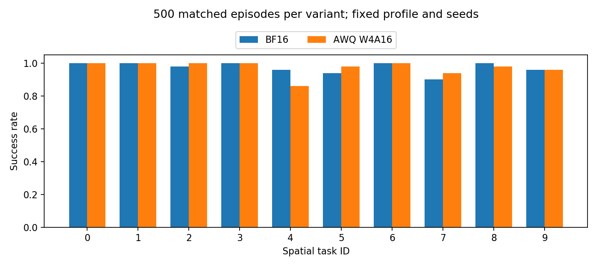
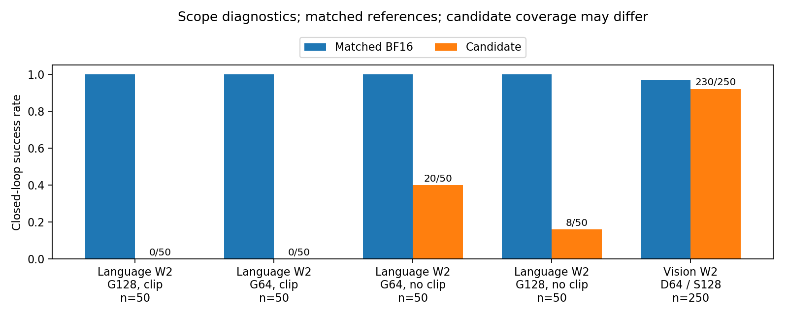
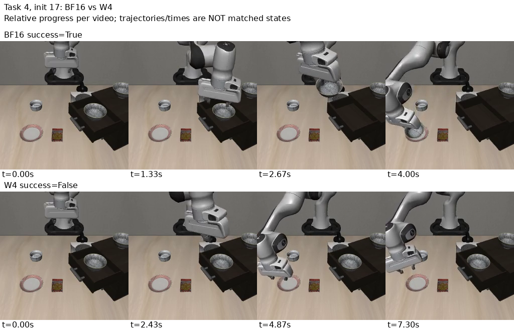

# 107本轮AWQ实验结果与分析

## 完成结果

|配置|成功/回合|成功率|程序异常|
|---|---:|---:|---:|
|BF16 Spatial500|487/500|97.4%|0|
|AWQ W4A16 Spatial500|486/500|97.2%|0|
|仅视觉W2、语言BF16|230/250|92.0%|0|
|视觉W2同初态BF16参照|242/250|96.8%|0|
|仅语言W2 G128 clip|0/50|0%|0|
|仅语言W2 G128 no-clip|8/50|16%|0|
|仅语言W2 G64 clip|0/50|0%|0|
|仅语言W2 G64 no-clip|20/50|40%|0|

语言四格都采用初态5–9，对应BF16为50/50。每片exit0、manifest按初态/hash/seed完全配对。正式500为10任务×50 rollout（非epoch），0–4重新运行且保留历史开发标记。跨会话只合并冻结源码/profile协议一致且初态唯一的数据；前轮220的来源见[前轮报告](../20260917-107-baseline-validation/README_CN.md)。本轮正式新增280/配置，原始小结果见[results](../../../../results/experiments/p0-foundation-baselines/20260917-107-baseline-continuation/README_CN.md)。

## 结论与边界

W4精度基线在当前Spatial协议下跑通，差−0.2个百分点；共同成功477、共同失败4，BF16独有10、W4独有9。McNemar p=1不证明等价，其他suite和多seed未验证。当前fakequant以BF16存权重，未测真实INT4/INT2内存和速度。

视觉W2采用DINO G64、SigLIP G128，不是整模型均匀2bit。250回合比同初态BF16低4.8个百分点，因此不能从旧10/10推出无损。已覆盖5–29；还需0–4、30–49共250回合。

语言G64无clip比G128无clip多成功12回合，但40%仍不能作为可用基线。不同group重新搜索了scale/clip，不能解释为纯group单变量；160语言clip移除为明确的post-search消融，源和派生hash/清单保留，不是新校准或微调。

W4任务4从BF16的48/50降至43/50。全部19组成对分歧视频索引见[data](data/baseline_disagreement_videos.csv)；5组任务4真实帧图见[溯源](figures/awq-spatial500-task4-contact-20260917/contact_sheet_manifest.json)。末帧碗仍在炉面，提示抓取/搬运问题；稀疏帧不能区分未抓到或滑落，不宣称层级因果。

## 科研分析与下次安排

[综合分析](ANALYSIS_CN.md)讨论PTQ、PEFT和Contextual Routing。先补视觉W2剩250，再做语言选择性clip/更细group或动作token目标；原OFT LoRA源形状映射已核验，422量化目标均有对应adapter、语言224含79,953,920参数，但runtime merge关系尚未验证，不能用Wmerged减delta冒充原base。静态PEFT与专家互补先验证，Router最后；SQ和微调本轮未新测。

校准profile实际32帧、10指令每条2–7帧。manifest64记录分为前32校准/后32诊断，不能把诊断帧并入训练后称held-out，不等于512轨迹。当前20GB空余足本轮评测；仅Spatial模型约15GB，四suite需对应模型/profile和空间规划。

## 备份与收尾

四份服务器持久盘/本地完整归档合计1450视频，每份10 SHA256通过：

- `20260917-107-spatial500-vision100-205053-852d350`：正式500两配置+视觉首100，1100视频。
- `20260917-107-language-fourgrid-214555-852d350`：语言四格200视频、G64派生profile、5组真实帧图。
- `20260917-107-vision-followup-220554-852d350`：视觉15–24的100视频及LoRA源审计。
- `20260917-107-final-close-221514-852d350`：视觉25–29的50视频与最新代码。

[核验回执](backup/)含清单、hash与恢复路径。大模型、校准集及原始W2/W4/G64/SQ profile不在普通Git，保留服务器原件；清单不是其异地备份。派生G64 profile已在语言完整归档内有第二份。图表与CSV/JSON原始数据通过manifest核验，并同步唯一zsure27/VLA-Quant。

五小时14:14:31 UTC观测剩7%触发收尾，不看周额度、不再派发、无定时任务。新增备份和Git核验后发出107原生关机请求；实际回执将另存，不将SSH断开等同平台OFF或停止计费。
