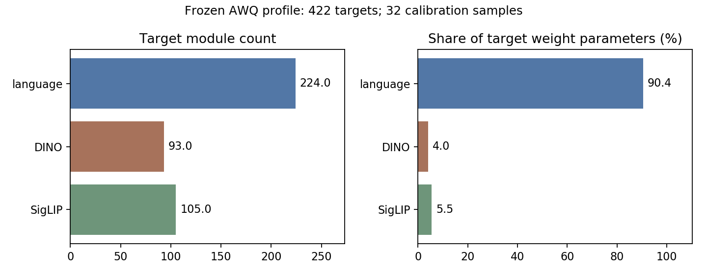
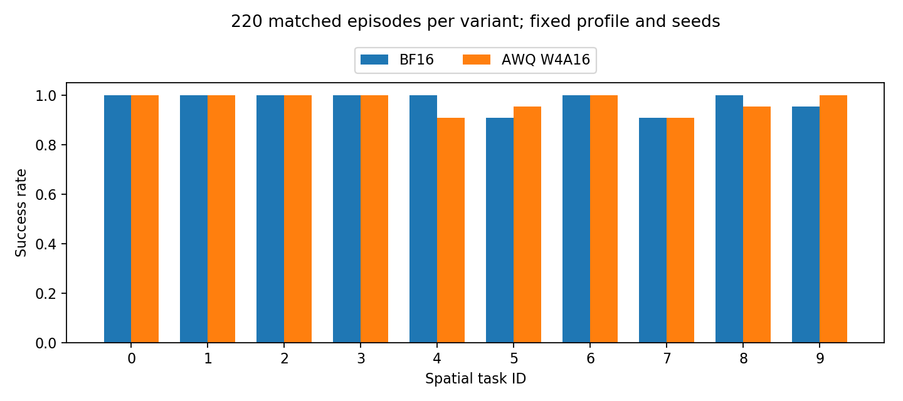
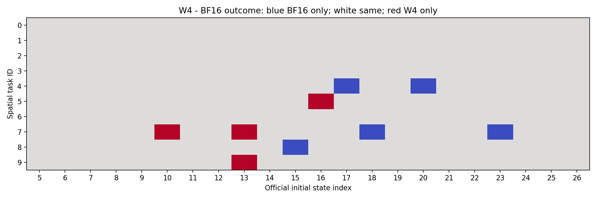

# 107：AWQ基线完整验证

本轮107已开机。优先补齐BF16/AWQ W4 Spatial各500次rollout，随后扩大视觉W2、诊断语言W2无额外clip；SQ和微调其次。本页在收尾时更新已完成结果，未完成分片不进入正式汇总。

## 冻结条件与分片

Spatial对应OFT checkpoint、既有W4 G128 profile、seed0和paired种子协议固定。双相机、proprio、L1 action head、8步chunk一致。BF16通过同入口scope none完全旁路；W4覆盖原422个目标。当前为BF16承载的fake quant，不代表实际INT4 kernel加速或显存压缩。

预算分片已覆盖官方初态5–14、15–24、25–26；待补27–34、35–44、45–49、0–4；每个初态包含10个任务，正式完成后每配置500次。旧开发集50次不直接拼入本轮；待补初态0–4曾用于历史开发，即使重新同协议评测，也应保留开发标记，不能重新宣称为独立测试集。逐回合初态hash与模型/环境种子核验配对，程序异常与正常策略失败分别记录。

固定10个任务上的成绩可用于当前suite比较；不能仅凭有限分片或差异不显著宣称无损、统计等价或完整QVLA数值复现。源码、profile hash随每片保存；冻结协议与公开论文的重复seed细节仍有差异。

## 数据与复现

真实profile审计见[awq-profile-metadata.json](awq-profile-metadata.json)，模块形状、校准预算、来源hash与覆盖均保留；分支统计CSV见[data/awq_scope.csv](data/awq_scope.csv)，运行[plot_awq_scope.py](plot_awq_scope.py)复现。语言约占量化目标权重参数的90.4%，视觉约9.6%；视觉W2有效只能支持该局部方案，主要参数压缩仍受语言低比特效果限制。此比例不含保护模块/元数据，不代表实际压缩率。profile校准样本数32，不能称复现论文512轨迹校准配置。

完成片的原始小日志和配对JSON位于[results/experiments/p0-foundation-baselines/20260917-107-baseline-validation](../../../../results/experiments/p0-foundation-baselines/20260917-107-baseline-validation/)。运行[reproduce.py](reproduce.py)生成真实已完成回合的CSV、汇总JSON和PNG/SVG图；没有完整配对片时不生成结果图。视频和逐步trace进入服务器持久盘及本地第二份压缩备份，Git保存清单/hash和小文件。

## 本轮已完成220组配对

|配置|成功/回合|成功率|程序异常|
|---|---:|---:|---:|
|BF16|215/220|97.73%|0|
|AWQ W4A16|214/220|97.27%|0|

覆盖官方初态5–26，每初态10任务，三个分片分别为5–14、15–24、25–26。各片BF16/W4为97/100与100/100、98/100与94/100、20/20与20/20；全部exit0、220条完整manifest配对一致。共同成功210组、共同失败1组、仅BF16成功5组、仅W4成功4组；W4相对BF16为−0.455个百分点，精确配对检验p=1.0，不证明等价或非劣。第一片曾为W4全成功，第二片出现掉点，不能从局部高分外推完整suite。

W4任务4有2次失败、任务7有3次失败，另任务5有1次共同失败；下一阶段先完成固定profile的500回合，再对失败视频作定位，不据本轮小差异启动微调选型。

逐回合数据见[data/paired_episodes.csv](data/paired_episodes.csv)，汇总见[data/summary.json](data/summary.json)，任务名称见[data/task_names.csv](data/task_names.csv)。仍缺280回合/配置：初态27–34（80）、35–44（100）、45–49（50）、0–4（50）。不能称Spatial500或四suite完整QVLA复现；没有新增SQ、PEFT训练或W2闭环结果。

完整归档26,519,858 bytes，包含440条原始MP4和逐步trace，服务器持久盘及本地两份保存、10项SHA256通过。[备份核验](backup/LOCAL_VERIFICATION.json)及[视频清单](backup/VIDEO_MANIFEST.json)可追溯。模型/校准/profile原件仍在持久盘，不属于该归档的跨机器备份。

## 存储

只读盘点见[storage_snapshot.json](storage_snapshot.json)。本轮已有模型约15GB，数据盘剩余约20GB，足够现有模型的评测日志、视频与备份。其他suite若需额外完整checkpoint，应先核实大小与共用权重；多个约15GB模型可能需要扩容。历史视频大小只用于容量估算，不是未来上界。

## 次要工作

[SQ_IMPLEMENTATION_AUDIT_CN.md](SQ_IMPLEMENTATION_AUDIT_CN.md)与8样本控制profile元数据只属于CPU源码/文件审计，没有新增SQ GPU性能结果，不改变AWQ优先级。

## 收尾状态

五小时剩余9%时已停止派发并完成全部结果双份备份；Git远端`f160afb`在关机前核验。北京时间13:40:57已执行107原生关机请求，SSH被远端关闭；[实际回执](backup/SHUTDOWN_REQUEST.json)记录supervisor838，平台OFF/停止计费尚未独立核验。等待下次手动开机并确认实例后继续AWQ。
