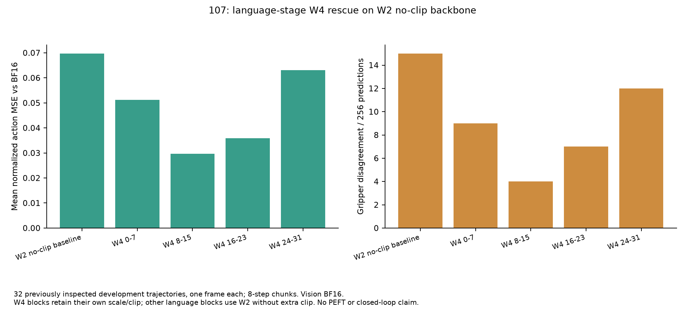
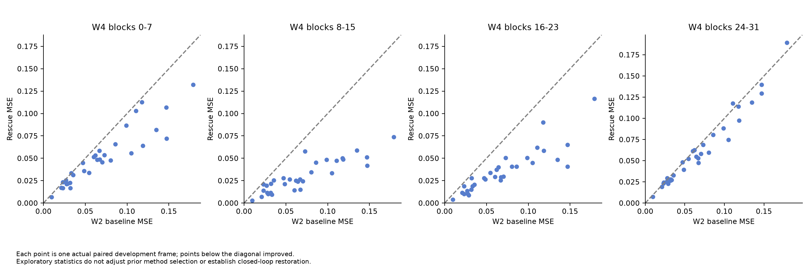
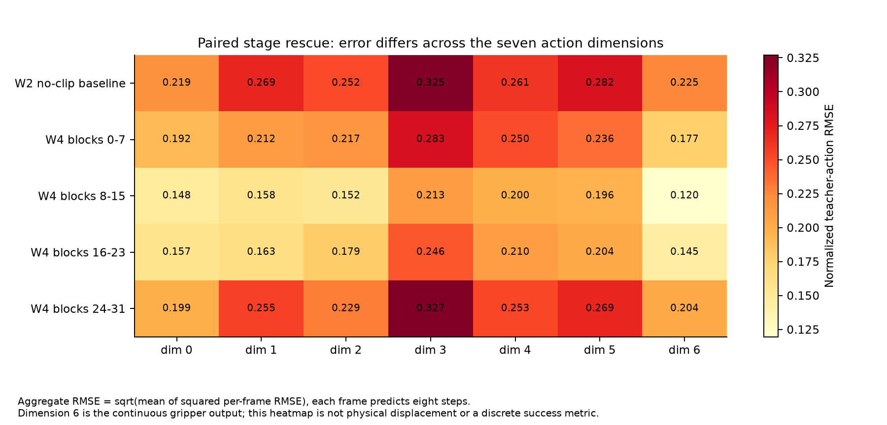
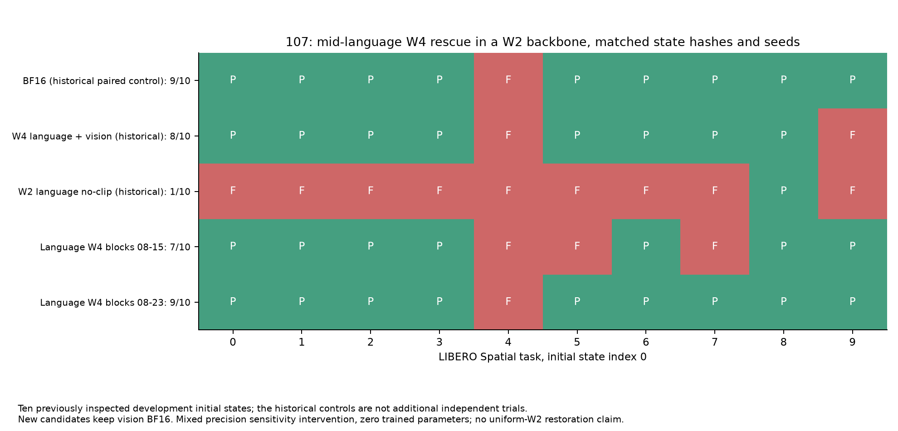
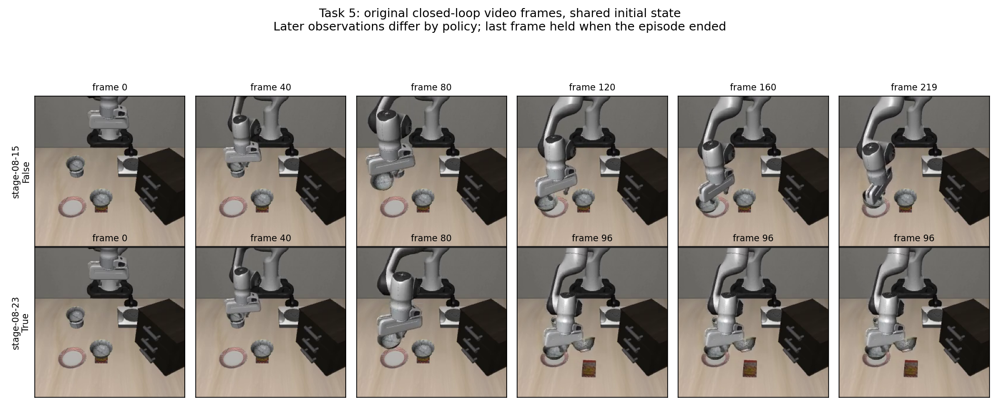
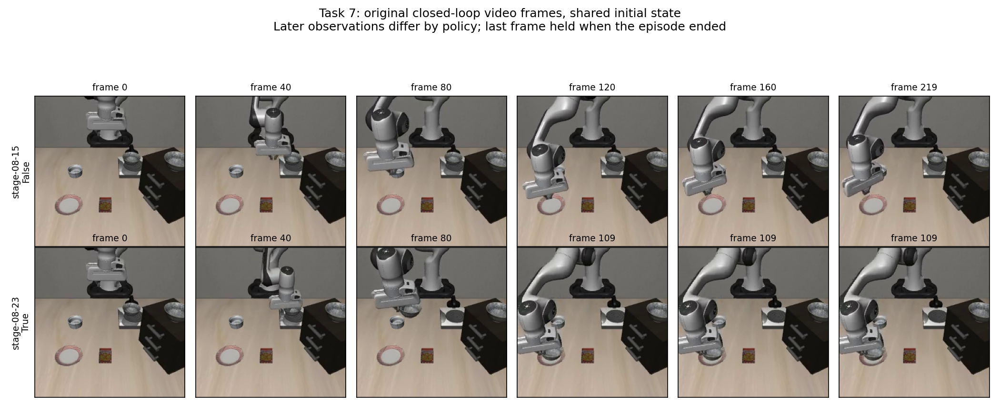
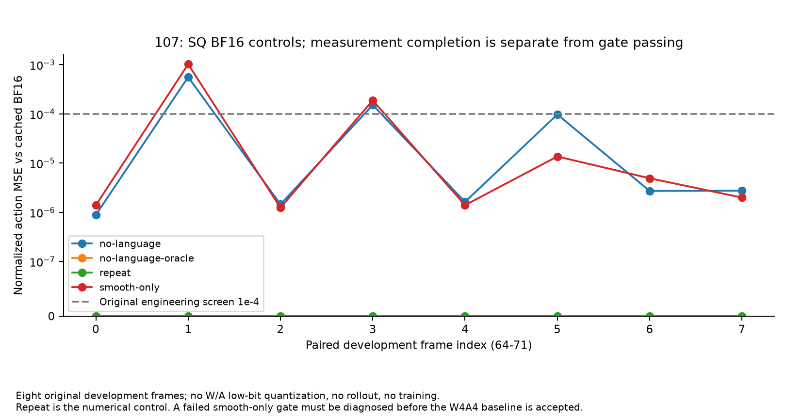
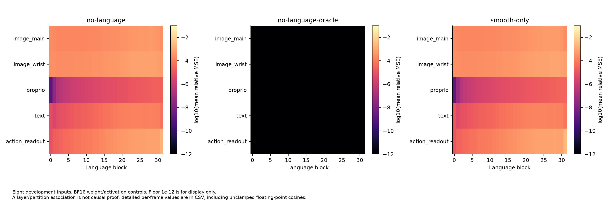
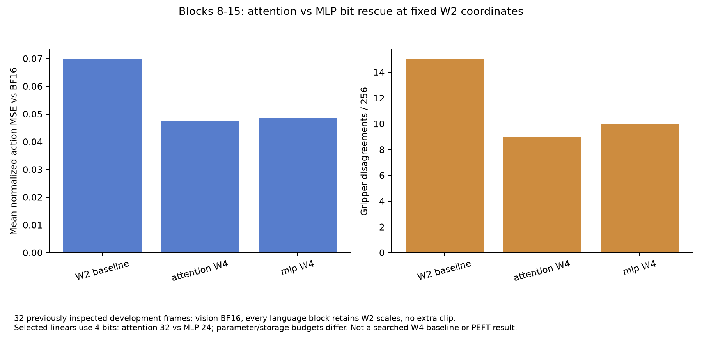

# 107 机本轮诊断：语言 W2 阶段回退与 SQ 数值控制

日期：2026-09-16。最新实验实例为从014克隆的**107机，SSH端口31263**；专用公钥认证成功，未使用或保存连接密码。容器hostname为`autodl-container-8b78499521-41be183e`，这是连入容器标识，不以它替代未经控制台核对的完整实例ID。本轮四段离线、两组闭环、四项SQ控制及两项模块族细分，共12项有限测量均已完成。

## 已确认的执行与数据

GPU RTX4090 24GB；连入时无其他计算进程；继承仓库base `852d35052526f79229362ac43571a009db0167e7`与014 evaluator dirty文件。诊断部署在独立`overlays/language-stage-rescue/`，保留旧历史代码与结果。probe的manifest核对checkpoint身份、官方源码、教师输入hash、样本、attention/backend等。

启动第一次因独立目录缺`smoothing_selection.py`的源码哈希依赖而退出；补齐依赖、添加快速预检查后重新运行。失败日志/输出保留，不将其计成成功测试。闭环使用第二个完整Git snapshot overlay，避免源码相对路径依赖缺失。已有历史运行代码不覆盖。本轮**没有训练PEFT，也没有验证packed kernel**。

## 当前实测

条件：视觉BF16，语言主体W2/G128去额外clip；选定完整8-block阶段使用独立W4profile的配对scale/clip。32个既有开发轨迹各一帧，预测8步，严格配对同输入。这批验证已被查看过，不是盲测。

| 配置 | 平均教师动作MSE | 夹爪分歧 /256 | 改善/恶化帧 |
|---|---:|---:|---:|
| 原语言W2无额外clip | 0.06972661 | 15 | 对照 |
| blocks0–7回退W4 | 0.05122427 | 9 | 30/2 |
| blocks8–15回退W4 | 0.02968988 | 4 | 32/0 |
| blocks16–23回退W4 | 0.03583929 | 7 | 32/0 |
| blocks24–31回退W4 | 0.06314109 | 12 | 24/8 |

中段8–15相对基线MSE降约57.4%，16–23降48.6%，前段0–7降26.5%，最后24–31降9.4%。支持优先研究中段；不能把整段测试解释成每个Linear的精确排名，也未证明训练可达。该干预需要额外高精度权重，**是敏感性/混精诊断，不是PEFT成果**。不能用fake quant近零显存差作rescue收益分母。

源数据在[data](data/)，包含实际逐帧MSE、7维normalized RMSE、夹爪分歧及探索性配对bootstrap；区间仅描述这32条开发轨迹，不修正过去选型偏差、不约束闭环成功率。原始metrics、scope、manifest、命令和console在[results/107-diagnostics-20260916](../../../results/107-diagnostics-20260916)。NPZ特征差异不进入普通Git，保留服务器/本地副本。

## 新闭环：中段保护能恢复开发初态，但不是统一W2成果

LIBERO Spatial tasks0–9，各init index0，seed0/env-seed0/paired protocol。新候选与旧BF16/W4/语言W2对照的十条`EPISODE_MANIFEST`逐项完全一致，包含初态hash、dtype/shape、环境和模型种子。两项exit0，没有episode error。

| 配置 | 成功/初态 | 每个task成功集合 |
|---|---:|---|
| BF16既有同loader对照 | 9/10 | 0,1,2,3,5,6,7,8,9 |
| 语言+视觉W4既有对照 | 8/10 | 0,1,2,3,5,6,7,8 |
| 语言W2/no-clip既有对照、视觉BF16 | 1/10 | 8 |
| 新：语言8–15为W4，其余W2、视觉BF16 | 7/10 | 0,1,2,3,6,8,9 |
| 新：语言8–23为W4，其余W2、视觉BF16 | 9/10 | 0,1,2,3,5,6,7,8,9 |

视频图上排8–15保护失败、下排8–23保护成功，展示不同闭环轨迹；帧索引、原视频hash与完整20个视频清单在[video-analysis](video-analysis/)。成功后停在最后一帧，图中重复末帧不表示策略持续没有动作。视频作为独立原件进入本轮原始归档，不仅保留截图。

实测说明保护中段能改变闭环行为，8–23在这十个开发初态上恢复到了BF16相同成功集合。不能据此声称统计等价、全suite泛化或纯W2微调完成：这些初态已被用于诊断；8–23保护了半数语言blocks，理论语言Linear权重平均约3bit，尚不含元数据和排除模块；视觉仍BF16。这里也没有新增全模型W2+DINO64闭环。

相对原语言W2，两项新增成功初态分别6、8，未丢失其task8；8–23相对8–15新增task5、7。task4也是BF16失败点，不能归为本轮量化专有损伤。后续优先验证未见初态，并缩小保护/训练范围，衡量真实存储成本。

新trace在`get_action`之前复制raw proprio，旧trace记录的是调用中被规范化后的proprio。**不直接对两者的state数值或后续轨迹求“同输入量化误差”**；本图只使用已核对的episode清单及实际成功标记。视频图另外标注闭环观测逐渐分叉。

## SQ数值控制：视觉误差可传播到动作，W4A4尚未认证

固定原8个开发输入sample0064–0071、同缓存BF16教师，W16A16，无低比特量化、无训练。

| 控制 | 平均动作MSE | 最大单帧MSE | 夹爪分歧/64 | 原阈值检查 |
|---|---:|---:|---:|---|
| BF16 repeat | 0 | 0 | 0 | 1e-10通过 |
| 全组仅平滑 | 0.0001543565 | 0.0010221635 | 1 | 1e-4未通过 |
| 关闭全部语言平滑、视觉仍平滑 | 0.0001023566 | 0.0005603094 | 1 | 1e-4未通过 |
| 同上，projector输出替换为缓存BF16 | 0 | 0 | 0 | 1e-10通过 |

误差最明显的是sample0065；关闭语言平滑只部分减轻异常。projector教师替换使八帧动作和语言特征误差归零，证明**在语言不平滑的条件下，视觉路径的变换误差足以产生当前动作差异**。这不排除独立语言平滑也会出问题，不证明某个视觉层实现错误；需要逐组旁路、FP32局部等价检查和BF16舍入分析。oracle需要教师，不是可部署方案或PEFT效果。

不能把这些W16A16问题归因于A4量化。保持原1e-4筛查规则，不事后放宽成“已通过”。目前完整SQ W4A4的当前配置闭环尚未认证；历史0/20和旧SmoothQuant摘要单独留在周末主报告，不拼接为本次新测量。先消除变换/数值语义疑点，再做W4A16、W16A4、W4A4逐项增量基线。

## 方法选择与下一步

已完成8–15段attention与MLP细分：全模型语言保留原W2 scale、所有语言clip关闭，选定模块直接用4bit伪量化，视觉BF16。因此这是**固定W2坐标的精度干预**，与前四项采用自有W4profile的整段rescue不同。

| 固定W2坐标配置 | 平均教师动作MSE | 夹爪分歧/256 |
|---|---:|---:|
| 原语言W2/no-clip | 0.06972661 | 15 |
| 中段8–15仅attention为4bit | 0.04736661 | 9 |
| 中段8–15仅MLP为4bit | 0.04872760 | 10 |

两项MSE分别降约32.1%、30.1%；两条路径均有可干预损伤，不能只归因于attention或MLP。attention32个Linear、MLP24个Linear，实际参数量/额外字节不同，不能只按Linear数量宣称公平预算。尚未做这两个配置的闭环或PEFT。下一条关键补充是**8–15全段在固定W2坐标下统一4bit/no-clip**，再与自有W4profile整段方案比较；没有该对照，不能将性能差异拆成scale/clip收益或模块间交互。

后续优先级：未见初态验证混精诊断→定位语言中段小范围修复→静态Recovery LoRA/冻结码尺度PEFT→有独立专家互补证据才做Contextual Routing。SQ先做视觉平滑数值旁路/FP32单模块检查，避免将基线实现差异交给微调掩盖。训练接口必须验证初始前向、整数码冻结、有效梯度及保存恢复，不把requires_grad标签当完成训练。

每两短/一长查询额度。中途一次有效读数为五小时剩57%、周剩85%；之后查询接口连续返回不可用，**当前剩余未知**，不得声称达到10%门槛。测试保持有限，预先准备持久盘备份和GitHub取回流程，保守收尾，避免空跑。停止/关机状态会在结束时更新，不以SSH中断当成平台已停止计费的证明。

复现图表：`python reports/sessions/20260916-107-diagnostics/reproduce.py`。只读取已取回的真实小数据，不连接服务器或读取凭据。

## 本轮备份和交接

四段离线、两组闭环、四项SQ控制及两项模块族细分，共12项有限测量全部完成，未保留训练中的optimizer/checkpoint。15项相关契约测试通过，新增CLI也已在GPU实测。七张数据图均有PNG/SVG和CSV，另有两张原视频对照图、逐帧来源及视频manifest；[manifest.json](manifest.json)绑定原始数据和图表。

持久盘归档：`/root/autodl-tmp/qvla-repro/backups/session107-20260916-193735-852d350/`。已取回本地第二份归档并核验SHA256清单列出的10个文件，总13,681,515字节，包含代码bundle、三套overlay、初次启动失败日志、原始NPZ和20个闭环视频。小清单、环境、历史dirty patch及恢复说明见[backup](backup/)。模型、原校准数据和历史教师不在此归档内，仍保留持久盘；未独立审核014所有大文件与107一致。

额度查询连续失败，无法确认剩余和下一长测试的安全预算，因此不再派发，主动收尾。GitHub实际身份`zsure27`、push权限已验证；代码与结果提交`a204a3a6f476dde80c8ab817ba07786c33d283b7`已推送，post-fetch核对远端main一致。之后的关机记录是追加提交，不是另一次测试。

北京时间19:44:20，107关机工具核验归档SHA256、当前base bundle及GPU无计算进程后，执行已验证的AutoDL原生supervisor停止机制；服务器随后主动断开SSH。具体请求回执见[closure.json](closure.json)。**关机请求已执行，平台OFF/停止计费尚未独立核验**：浏览器仍在登录页，控制台状态待独立核验。不得将SSH断开写成平台已确认关机。没有销毁107、清空Trash、删除模型/原校准集或唯一结果。
