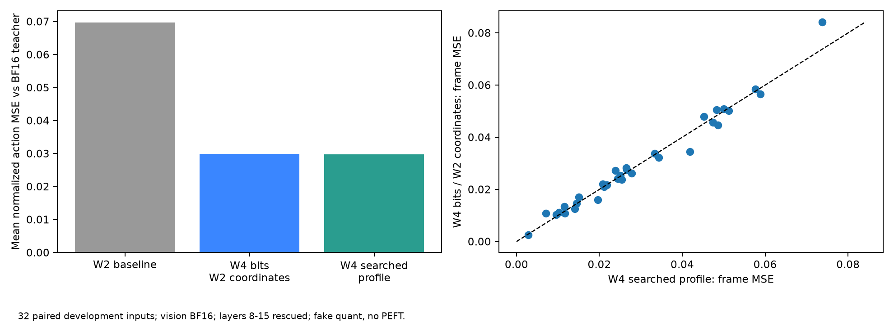
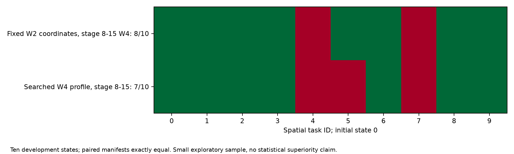
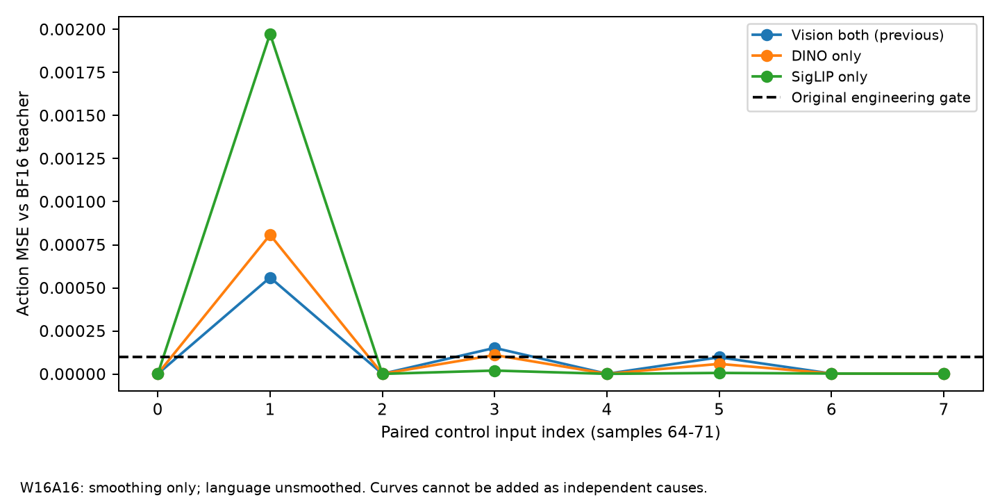
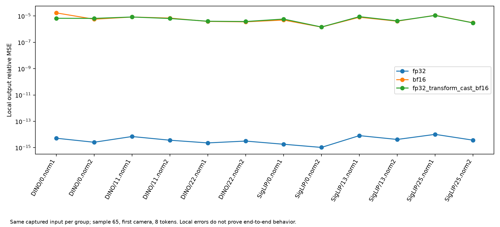
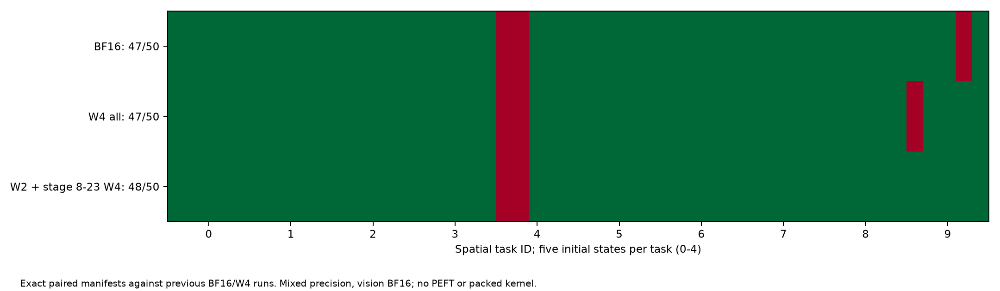
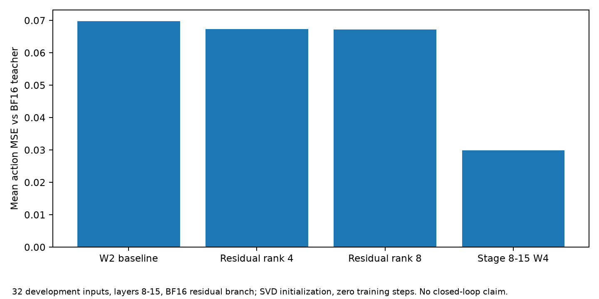
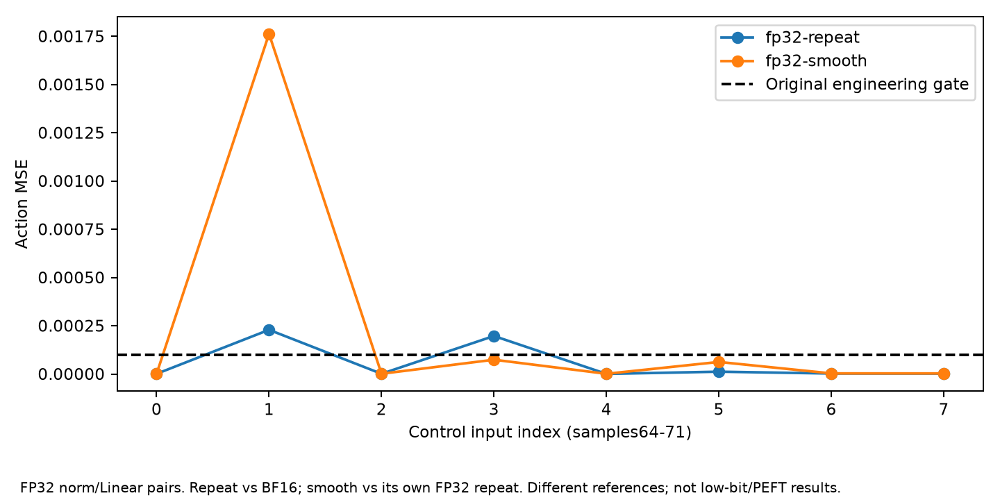
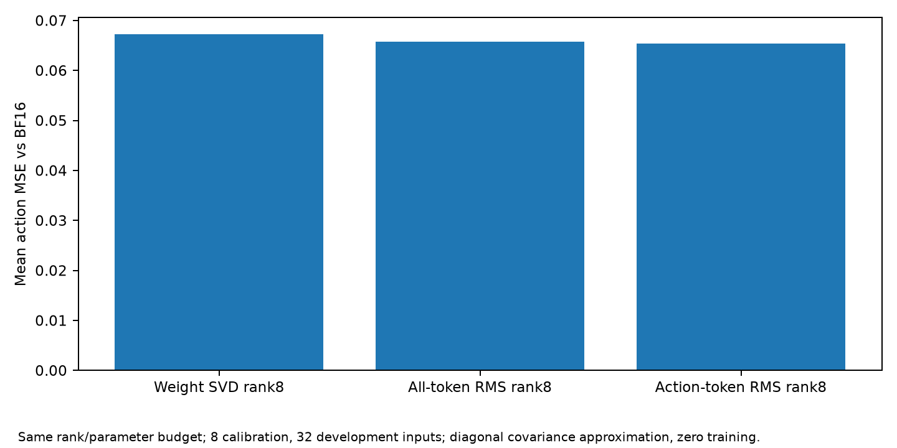

# 107 续实验：位宽归因与视觉平滑数值定位

用户明确告知107已开机后，经SSH端口31263/专用公钥核验同一hostname、RTX4090及实际原始产物开展。本报告由原始指标生成；无PEFT训练、无真实低比特内核测试。最新扩展闭环未完成前不得填入成绩。

## AWQ：固定缩放坐标的位宽对照

32个输入sample1000–1031，与上轮同输入、教师、随机种子和模型；视觉保持BF16，语言W2 G128且取消额外剪裁。仅将语言8–15层全部56个Linear提升到4bit，保留W2 block scales与entry input scales，不借用W4 profile及其剪裁。原profile不被修改。

|配置|平均动作MSE（相对BF16）|夹爪分歧步数|
|---|---:|---:|
|语言W2无额外剪裁|0.06972661|15/256|
|8–15层W4，保持W2坐标，无额外剪裁|0.02988279|4/256|
|上轮8–15层使用W4自有scale/clip|0.02968988|4/256|

固定坐标位宽提升已贡献大部分平均误差恢复，不能将此前效果只归于AWQ重新搜索。搜索参数方案的平均MSE约低0.65%，但逐帧差值有正有负；这不是统计等价、模型普遍不需要搜索或训练方法优势的证明。

十状态闭环严格匹配完整episode manifest（初态hash、dtype/shape、模型/环境种子），固定坐标方案8/10、上轮自有W4参数方案7/10。仅一个成功数差，属于开发筛选，不声称统计优越；混合位宽恢复不是均匀W2成功或PEFT收益。

## SmoothQuant：两个视觉分支分别进行W16A16平滑

8个旧控制输入sample64–71；语言完全不平滑，只有指定视觉分支的完整norm→linear组平滑，不量化权重或激活，不使用projector教师替换。

|仅平滑范围|平均动作MSE|最大动作MSE|夹爪分歧|
|---|---:|---:|---:|
|两视觉分支（上轮）|0.000102357|0.000560309|1/64|
|DINO|0.000123520|0.000807842|1/64|
|SigLIP|0.000251068|0.001973883|2/64|

三组均不满足原最大MSE≤1e-4筛查门槛。两个分支的平滑数值改变都足以引起动作差异；仅SigLIP差异较大。共同平滑存在抵消，不能把两组误差相加当独立因果贡献，也不能据此排除语言自身平滑问题。

## 局部FP32/BF16等价性

仅用sample65，捕获第一相机调用、每组前8个展平token的教师输入。DINO blocks0/11/22和SigLIP blocks0/13/25，各检查norm1→qkv、norm2→fc1，共12组、三种数值情形36项。原始模型权重不被修改，使用独立模块副本；FP32控制将同一份原始BF16存储参数提升到FP32，TF32关闭。

|计算情形|12组最大相对MSE|平均相对MSE|
|---|---:|---:|
|参数/激活/变换FP32|1.0195e-14|4.4138e-15|
|参数/激活/变换BF16|1.7303e-5|6.5478e-6|
|FP32计算变换后，参数与激活转回BF16|1.0974e-5|5.8622e-6|

所测组在FP32下近似满足理论等价；BF16会产生局部差异。仅把变换计算提升FP32不足以消除参数回写/激活舍入。此结果支持沿数值误差传播继续定位，**不证明所有162组都正确、不证明整个视觉网络首异常位置、不将局部相对MSE阈值与动作MSE阈值混用**。这里检查的是平滑重参数化，不能归因于A4损伤。

下一项SQ预实验：选择已测组，用少量完整FP32平滑配对计算或保留原LayerNorm的显式缩放执行作数值诊断，再检验端到端动作变化和计算代价。只有数值控制充分理解后，才做W4A16、W16A4、W4A4递进验收。新增通道affine/clip/低秩修复器可作为偏PEFT方向，须先验证扰动、梯度、保存恢复及静态恢复效果；不直接训练Router掩盖数值控制问题。

## 数据与恢复

[data](data/)保存实测CSV，[manifest.json](manifest.json)绑定原始小数据与图；文本哈希采用LF归一化，二进制按原字节。原始小日志、配置、manifest和指标在[results/107-followup-20260916](../../../results/107-followup-20260916)。原服务器SHA256SUMS含未放普通Git的NPZ，不能仅以小文件副本宣称完整原目录校验；完整产物另作服务器持久盘及本地二进制备份。

运行`python reports/sessions/20260916-107-followup/reproduce.py`生成图与CSV，不连接服务器。

## 50状态扩展闭环已完成

语言8–23层采用W4自有scale/clip，剩余语言层W2无额外clip，视觉BF16；匹配既有完整BF16/W4基线的50个初态（10任务×5初态，indices0–4）、种子及episode清单。50条完整manifest完全相同，正常结束、无episode error。

|配置|全部50初态|初态1–4的40条|
|---|---:|---:|
|BF16（旧配对基线）|47/50|38/40|
|全AWQ W4（旧配对基线）|47/50|39/40|
|语言8–23层W4恢复、其余语言W2、视觉BF16|48/50|39/40|

初态0十条曾用于选择候选，不能重新计为独立新证据；init1–4未用于此前该候选的十状态筛选，但仍是固定开发集，不能当最终benchmark或反复选型后的严格独立测试集。新增配置的成绩不证实统计优越/等价，不能把高精度视觉及大量W4语言层称为均匀W2或小参数微调成功。它提供一个可用于诊断静态修复器能力的恢复参照。

## 小参数残差分支：初始化容量探针已完成

仅语言8–15层的56个Linear挂载BF16低秩分支，保留所有W2量化权重、原AWQ坐标和无额外clip；量化前后的同坐标权重差用固定种子的randomized SVD初始化。不是gradient微调，也不使用验证集来拟合。原代码与指标记录training_steps=0。

|初始化|参数量|平均动作MSE|夹爪分歧|平均未解释权重残差比例|
|---|---:|---:|---:|---:|
|rank4权重SVD|2,498,560|0.06740638|12/256|0.994250|
|rank8权重SVD|4,997,120|0.06723416|13/256|0.991014|

相比0.06972661的W2基线，动作MSE仅降低约3.3%/3.6%；增加rank没有改善夹爪分歧。权重残差比例是初始化FP32因子的几何度量，不能当真实BF16分支前向误差，也不是最优rank上界。低秩分支的冻结、梯度和保存恢复只在局部组件合同测试中验证；本轮未建立完整可微策略训练循环，因此不能称“PEFT已训练跑通”。推理也仍使用浮点存储的模拟量化基座。

下一对照保持rank8和相同参数预算，用8个独立校准状态的全token/动作token RMS做输入对角协方差加权：近似优化`||(ΔW−BA)diag(RMS(x))||²`，检查权重范数是否忽略控制相关方向。这里只是更换局部初始化目标，不是动作损失微调、上下文专家或Router效果。

## 局部FP32配对未修复端到端数值控制

对98个完整视觉norm→qkv/fc1组提升计算/参数精度，Linear输出仍返回BF16，其余视觉层、projector和语言维持BF16。两个计算路径使用相同8个控制输入；第二条明确加载第一条导出的FP32路径教师，防止混淆参照。

|情形|参照|平均动作MSE|最大动作MSE|夹爪分歧|
|---|---|---:|---:|---:|
|提升配对精度，不平滑|原BF16|5.54434e-5|2.28740e-4|2/64|
|同一路径加视觉平滑|上述未平滑FP32配对路径|2.38356e-4|1.76225e-3|1/64|

两条均未通过原1e-4最大动作MSE门槛；不同参照的MSE不能当成直接收益比较。局部12组FP32等价性不能推导全98组/整个视觉路径等价，尤其配对输出仍反复舍入回BF16。下一数值定位保持整个视觉骨干FP32，仅在projector入口返回BF16，同样需要未平滑与平滑配对控制；这将增加显存和计算，属于定位工具而不是低比特部署或PEFT方法。

## 同预算激活加权探针已完成

同rank8/56个Linear/4,997,120个参数，使用原校准目录indices64–71的8个输入拟合统计，验证仍为1000–1031的32帧。校准调用发生在官方block scales已应用、任何Linear尚未量化的教师模型上；三种随机数状态在校准前后恢复，初始化每个Linear使用稳定独立种子。动作token边界由模型实际回归调用给出的patch/prompt长度及56个action readout token确定，不以固定视觉token长度猜测。

|rank8初始化|平均动作MSE|夹爪分歧|相对W2基线MSE降低|
|---|---:|---:|---:|
|权重残差SVD|0.06723416|13/256|3.57%|
|全token RMS对角加权|0.06573510|14/256|5.72%|
|动作token RMS对角加权|0.06544165|13/256|6.14%|

输入加权略有改善，但夹爪尚未体现稳定收益；不能声称动作token加权在小样本上统计优于全token。对角协方差忽略通道间相关性，且使用教师输入，尚不补偿真实量化前缀导致的输入分布变化。后续已准备响应子空间初始化：从`ΔW·X_action^T`选择低秩输出方向，而不只看逐通道RMS；组件数学测试通过，**本轮未执行GPU测量**。完整可微策略训练及闭环LoRA同样未开展。

## 本轮阻塞与收尾

本轮8个批次中12项有限测量完成：32帧位宽对照、两个8帧视觉分支控制、12组局部等价性、十状态与50状态闭环、两个32帧权重SVD、两个8帧FP32配对控制、两个32帧输入加权。重复开发帧不增加独立样本量。

自动审批多次引用上轮19:44的107关机记录，拒绝新的全视觉FP32控制；已补充用户本轮开机指令、跨日SSH在线证明、GPU及剩余47%/68%额度仍未获准。拒绝命令未执行。最后因无法恢复派发而收尾，**不是额度低于10%或假称服务器已关机**。全视觉FP32两控制、响应SVD、实际微调训练、LoRA闭环均标未执行。没有绕过审批执行。

服务器完整备份位于`/root/autodl-tmp/qvla-repro/backups/session107-followup-20260916-000600-852d350/`，包括60条真实闭环视频、原始trace、NPZ、FP32教师PT、代码overlay和旧基座git bundle。模型、校准原件和原始profile不进普通Git，清单、哈希及恢复路径保留；本地第二份及SHA核对情况见收尾记录。不删除唯一结果或校准原件。

额度读数本轮确认可用：Python3.12正常，已额外修复旧版Python不能解析Z结尾时间戳的问题；原实际剩余比例与预计测试消耗单独表示。启动命令两次被自动审批误读而拒绝，后经独立官方额度和用户本轮开机授权证据获准；拒绝的命令未执行、不产生实验结果。

最终收尾：10个备份文件共263,875,140字节，服务器与本地两份SHA256全部核对；GitHub关机前提交`99d4bc1`已核验。北京时间2026-09-17 00:11:47对本轮107的supervisor PID 837执行原生关机请求，SSH随后被远端关闭。控制台登录过期，**平台OFF及停止计费尚未独立核验**；未删除实例、数据或设置定时关机。详细凭据见`closure.json`。
