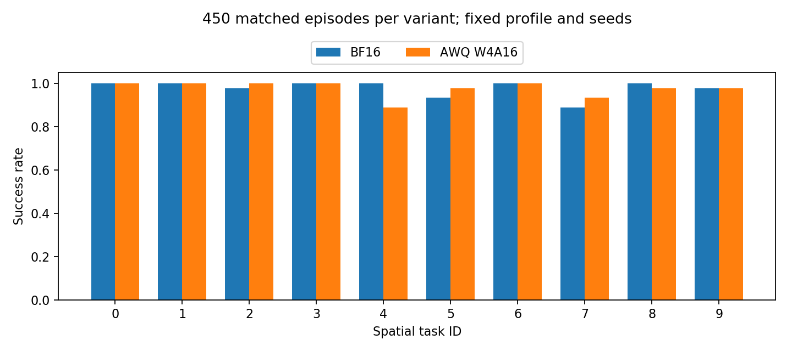
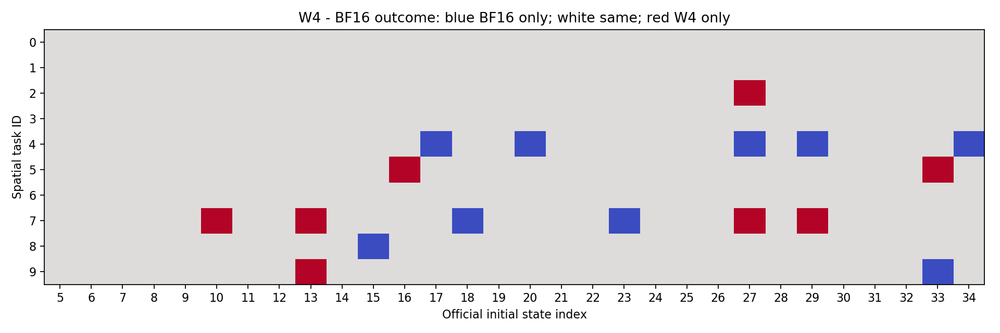

# 107 AWQ基线续测：补齐Spatial500

本轮用户自行开机107，SSH确认同一4090、冻结evaluator及W4 profile hash一致，开始官方初态27–34的BF16/W4各80回合分片。先补齐W4基线，再扩大视觉W2、归因语言W2；SQ和微调其次。

上轮原始220组配对见[前轮报告](../20260917-107-baseline-validation/README_CN.md)，本轮新增源数据独立放在[results/107-baseline-continuation-20260917](../../../results/107-baseline-continuation-20260917/)。冻结两源码/profile hash、checkpoint与paired协议核验一致后，才能跨会话累计；禁止重复计入初态。

待补分片：27–34各80、35–44各100、45–49各50、0–4各50，合计本轮目标280/配置，与前轮220合计500。初态0–4曾用于历史开发，重新评测仍保留开发标记；不拿旧开发50直接拼接。

[reproduce.py](reproduce.py)只读取完整配对片，输出数据保留source_shard/source_session，生成分任务、逐初态与配对结果图。当前GPU测试未结束，最终汇总、备份和关机状态在收尾阶段更新。固定任务、fake quant及公开论文重复seed细节的协议边界沿用前轮，不宣称实际INT4存储/加速或统计等价。

额度只看五小时：>=20%每2长/3短检查，<20%每次，<10%立即备份关机，至少保留3%，无定时任务。

## Spatial500正式结果

|配置|成功/回合|成功率|程序异常|
|---|---:|---:|---:|
|BF16|487/500|97.4%|0|
|AWQ-W4A16|486/500|97.2%|0|

10任务各50回合、初态0–49完整唯一覆盖。各分片exit0，500组manifest逐项一致；初态0–4为新日志重新运行，保留曾用于开发的标记。共同成功477、共同失败4，仅BF16成功10、仅W4成功9；差−0.2个百分点，McNemar精确p=1.0不证明统计等价。当前模型、校准profile和成对协议下W4精度基线能够跑通，尚不能宣称论文复现完全一致或真实INT4加速。

平均值掩盖局部退化：任务4的BF16为48/50、W4为43/50（少5次），任务5与7的W4各多2次。后续应优先查看任务4失败视频和误差，而非只追总体均值。`data/policy_finite_checks.json`核验原始策略查询finite标记；闭环不同观测不用于直接跨模型动作MSE。

本轮随后正在执行视觉W2、语言BF16的初态5–14共100回合，尚未计入正式W4基线。DINO G64、SigLIP G128、clip保留，不能标为整模型均匀W2。语言W2 clip/no-clip为下一配对诊断；SQ和微调其次。

## 数据与备份状态

误退出Codex后有限nohup任务继续，不自动无限派发；接回SSH后已续跑。每份原始小结果下载SHA已对照服务器：27–34 `92c73affb8a5581fe15a43eb8a838f3671425ffd46b2aed3ad54226574f408b9`；35–44 `7de1dbd9759d08e94f7f9c1f9ef2e5d38a2718695e10d6d056909ac94d99d003`；45–49 `32e147d933c37caed743b791358065504031ad0b8b17ea1d222266b97fd61da8`；0–4 `69995f7134f59bc139dec63478be64522f0a989e50a2eddefc0ed7662d6a706e`。完整视频第二份归档及关机状态将在收尾阶段记录。

## 已完成视觉W2配对诊断

初态5–14：视觉W2 93/100、配对BF16 97/100、整模型W4 100/100。BF16独有成功7，视觉W2独有3；任务1、5分别7/10、8/10，任务7为8/10，与BF16持平，任务9由9/10升至10/10。该视觉配置可执行，但并非普遍无损，不是整模型W2。

完整500配对与视觉100已生成双份归档：服务器`/root/autodl-tmp/qvla-repro/backups/20260917-107-spatial500-vision100-205053-852d350`及本地`results/pending-20260917-107-baseline-continuation/20260917-107-spatial500-vision100-205053-852d350`；63,345,952字节结果归档、1100视频、10项SHA256通过。核验回执见[backup](backup/LOCAL_VERIFICATION.json)。模型和原校准集未包含在此归档，不宣称已有异地模型备份。

语言W2 G128无剪裁初态5–9：8/50、配对BF16 50/50、0程序异常；已完成原始manifest检查，数据将随下一批归档取回。保留剪裁同50初态正在测试，不提前填入未测结果。下一控制使用独立原生G64搜索profile，保持视觉BF16；这是PTQ搜索配置变化，尚无训练或PEFT效果证据。

## 语言W2 G128剪裁对照已完成

同初态5–9、同seed与BF16成对manifest完全匹配：保留剪裁0/50、去除语言160个clip为8/50、BF16 50/50，全部exit0且0程序异常。原始数据已落地`results/107-baseline-continuation-20260917/awq-scope-shard-language-*`，下载SHA256 `5526ca8846952e7b0b31dd5d36a5dc794ea07fca36f1b40ee67529e97368a65c`。无clip带来有限改善但尚不可用；不是训练所得改善。G64 clip仍在运行，未将局部结果填写为完整实验。

下一步G64无clip会明确标为原生G64 profile的post-search clip消融，并携带原始profile哈希、160条变换清单与派生profile哈希。原始搜索参数和校准溯源保留，绝不称为重新校准；冻结evaluator不变。语言四格PTQ比较结束后按预算优先扩大视觉W2，PEFT为辅。

## 完整语言四格结果与真实失败帧图

|语言配置（视觉BF16）|相同初态5–9成功/50|程序异常|
|---|---:|---:|
|G128 clip|0|0|
|G128 no-clip|8|0|
|G64 clip|0|0|
|G64 no-clip|20|0|
|BF16参照|50|0|

所有manifest成对核验；40%有所改善但不能称为可用W2基线。[完整分析](ANALYSIS_CN.md)说明校准预算、局部失败、论文主线和后续PTQ/PEFT/Routing假设。

图中为不同视频各自进度，不是同状态动作误差；初态17/20/27/29/34的完整图片与视频hash见同目录manifest。语言四格200视频及完整G64派生profile已双份归档`20260917-107-language-fourgrid-214555-852d350`，45,252,013字节结果归档、10 SHA256通过，回执见[backup/language-fourgrid](backup/language-fourgrid/LOCAL_VERIFICATION.json)。原始G64搜索profile仍在服务器，不把清单当作其异地副本。

当前继续视觉W2初态15–24共100，尚未计入汇总，随后按预算补齐剩余官方初态。
