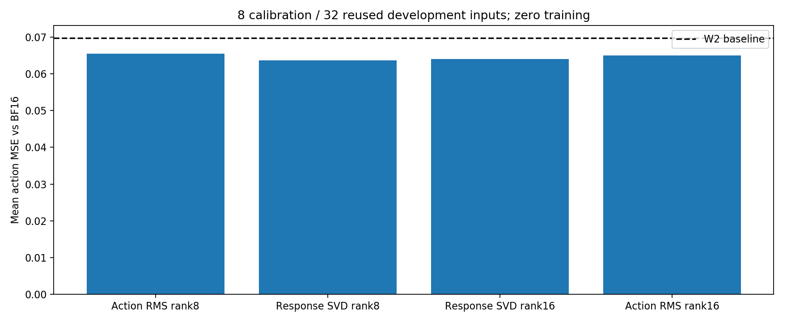
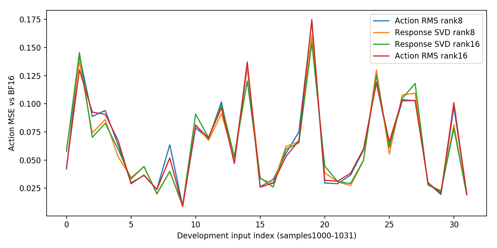

# 动作token响应SVD：107有限预实验

本轮用户在107再次开机后明确授权继续响应SVD。目标是区分“重建权重矩阵”与“补偿动作输入引起的量化响应”两个低秩初始化目标；保持语言AWQ W2G128无额外clip、视觉及action head等保护模块BF16，在语言8–15层56个Linear各添加高精度低秩残差。

## 设计和可复现性

令量化权重为Wq、原浮点缩放权重为W，误差ΔW=W−Wq，动作token输入行矩阵为X。响应SVD对ΔW·Xᵀ进行随机低秩分解，取输出主方向Uᵣ；初始化B=Uᵣ、A=UᵣᵀΔW，前向输出增加B·A·x。此目标保留通道相关性，区别于对角RMS加权SVD。主干冻结，残差分支BF16，不更新优化器。

8个校准输入为sample-0064至0071，使用教师AWQ缩放后的真实动作token输入，每个模块448行；动作边界由模型Recorder获取。32个验证输入为sample-1000至1031，严格与历史动作RMS对照配对；reproduce.py核对校准清单hash及验证ID。这些验证输入已多次用于开发，不能视为新的独立测试集。seed7及逐模块稳定种子、源码、配置和命令均保存。

rank8参数4,997,120；rank16参数9,994,240。新增rank16动作RMS作为参数量匹配对照。所有测试training_steps=0，不是完成PEFT训练，不是闭环成功率，不是packed INT2内核或真实部署压缩性能测量。

## 已测结果与分析

|初始化|参数量|动作MSE|夹爪不一致|
|---|---:|---:|---:|
|Action RMS rank8|4,997,120|0.06544165|13/256|
|Response SVD rank8|4,997,120|0.06361106|11/256|
|Response SVD rank16|9,994,240|0.06399096|13/256|
|Action RMS rank16|9,994,240|0.06503257|13/256|

实测汇总见[data/summary.csv](data/summary.csv)，逐帧数据见[data/frames.csv](data/frames.csv)，模块几何诊断见[data/module_geometry.csv](data/module_geometry.csv)。夹爪不一致分母为32×8=256个动作步。

响应rank8动作MSE为0.06361106，比同参数动作RMS rank8的0.06544165低约2.8%，比原W2基线0.06972661低约8.8%；夹爪不一致11/256，历史RMS为13/256。响应rank16为0.06399096，夹爪13/256，未体现增加rank的单调改善。

响应rank8各模块校准响应剩余能量比例平均约15.85%，rank16约4.65%；这仅是初始化FP32分解几何、模块比例的等权均值，并非整个策略响应能量或BF16实际前向的误差比例。局部校准响应可以大幅重建，策略动作仍恢复有限：提示教师输入与真实量化前缀的分布偏移、未处理其他层误差、不同层误差交互及校准过拟合等因素值得配对检验；当前不能单独确认哪一项是根因。

匹配rank16动作RMS对照为0.06503257，夹爪13/256；响应rank16同预算MSE低约1.6%。rank8同预算优势约2.8%，证据更支持优化方向选择而非单纯增加rank；微小差异仍仅是重复开发集描述，不是统计显著性或闭环性能结论。三项新GPU测试均exit0，96次开发帧评估不增加独立输入数量。

## 后续研究取舍

1. 在同位宽/同参数/同数据预算下，开展静态低秩补偿训练，明确区分层输出蒸馏与策略动作蒸馏；训练前先做真实量化前缀输入校准与教师输入校准的对照。
2. 保持已验证的W4路线为sanity参考；语言中段混合W4的48/50是另一恢复策略，不能记为均匀W2或PEFT收益。
3. 静态分支获得可复现闭环收益后，再检验不同任务或动作阶段的补偿方向是否互补。只有互补性得到独立数据支持，才值得引入Contextual Routing的条件专家；本轮未训练Router。
4. SmoothQuant数值一致性问题仍独立存在。本轮不执行全视觉FP32控制，不将SVD进展混同为SQ W4A4基线已跑通。

## 原始产物与收尾

原始小文件位于[results/107-response-svd-20260917](../../../results/107-response-svd-20260917/)，与本报告相互引用。大型原始输出和源码overlay另外双份备份，不上传模型、校准原件或凭据到普通Git；初始低秩权重本轮未单独保存，恢复需从记录的源码、profile、校准及seed重初始化并核验指标。没有训练checkpoint或优化器状态。

备份、额度及关机实证在closure.json和backup/记录；不凭SSH断开声称平台OFF已核验。

本轮13,079,907字节完整备份已在服务器及本地保留两份，10项SHA256核验通过。最后有效额度五小时17%、周63%（历史观测）；下一项有效训练/闭环预计超出本轮剩余预算，预先收尾。
